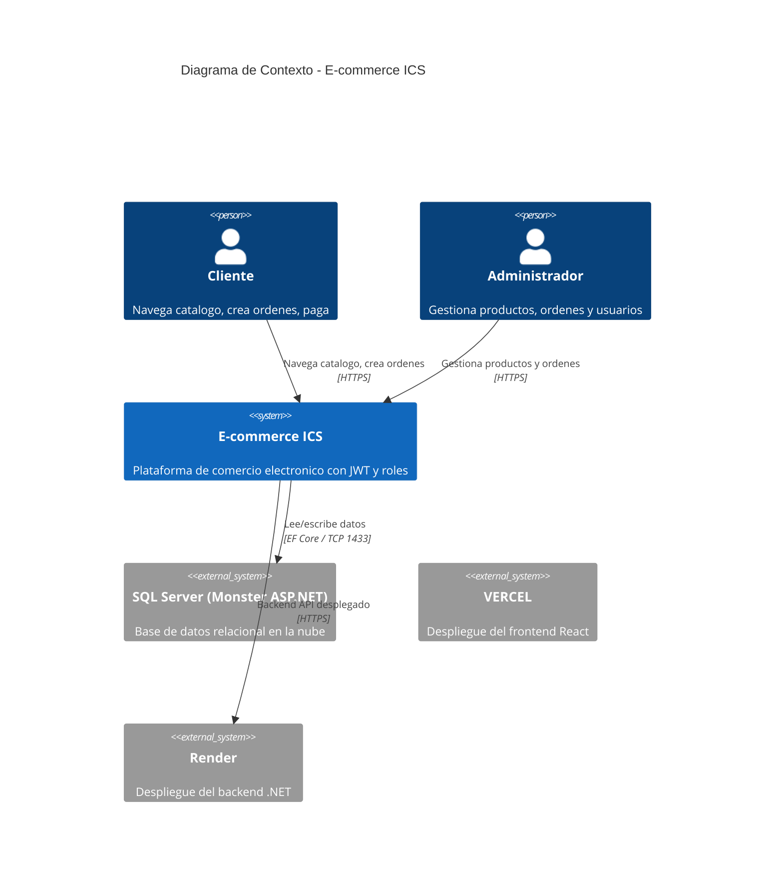
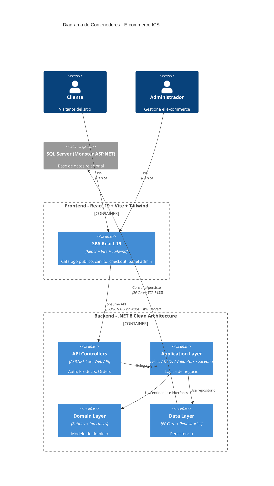
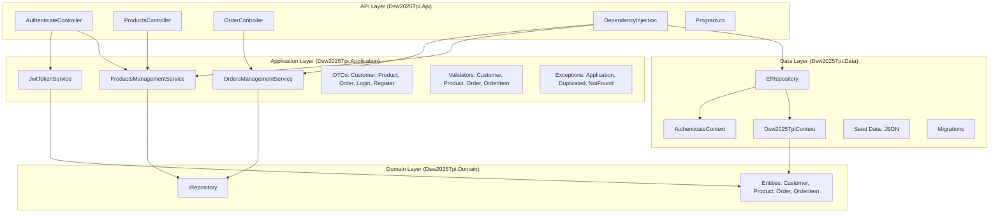
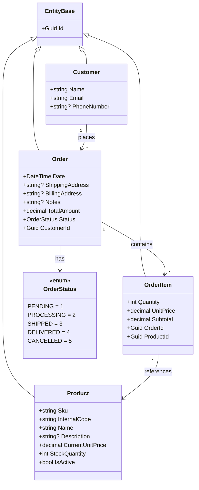
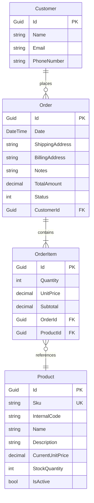

# ICS — Trabajo Practico Integrador: Plataforma E-commerce

**Materia:** Ingenieria y Calidad del Software
**Proyecto:** E-commerce ICS
**Stack:** React 19 + .NET 8 (C#) + SQL Server
**Estado:** En desarrollo

**Tablero Trello:** [TPI Ingenieria y Calidad de Software](https://trello.com/b/tpi-ingenieria-calidad-software)

---

## Vision General

Plataforma de comercio electronico desarrollada como Trabajo Practico Integrador. El sistema permite gestionar productos, administrar ordenes de compra, soporta autenticacion con roles (Administrador / Cliente) e incluye un catalogo publico con carrito de compras.

---

## Arquitectura

### C4 Model — Nivel 1: Contexto



### C4 Model — Nivel 2: Contenedores



### C4 Model — Nivel 3: Componentes (Backend)



---

## Modelo de Dominio

### Entidades



### Diagrama ER



---

## Stack Tecnologico

### Frontend

| Tecnologia | Version | Uso |
|---|---|---|
| React | 19.1.1 | Framework UI |
| Vite | 7.1.7 | Bundler y dev server |
| React Router DOM | 7.9.4 | Enrutamiento |
| Axios | 1.13.2 | Cliente HTTP |
| React Hook Form | 7.65.0 | Formularios |
| Tailwind CSS | 4.1.14 | Estilos utility-first |
| jwt-decode | 4.0.0 | Decodificacion de JWT |

**Despliegue:** Vercel (frontend SPA estatico)

### Backend

| Tecnologia | Version | Uso |
|---|---|---|
| .NET | 8.0 | Plataforma |
| C# | 12.0 | Lenguaje |
| Entity Framework Core | 9.0.6 | ORM (SQL Server) |
| ASP.NET Identity | -- | Autenticacion y usuarios |
| JWT Bearer | -- | Autenticacion JWT |
| Swashbuckle | 6.6.2 | Swagger/OpenAPI |

**Despliegue:** Render (servicio web)

### Base de Datos

| Tecnologia | Uso |
|---|---|
| SQL Server | Base de datos relacional |
| Monster ASP.NET | Hosting SQL Server en la nube |

**Conexion:** EF Core via TCP 1433

---

## Estructura del Proyecto

```
ICS/
├── ICS_TPI2026_frontend/          → Frontend (React 19 + Vite + Tailwind)
│   └── src/
│       ├── modules/
│       │   ├── auth/              → Login, Register, ProtectedRoute
│       │   ├── products/          → CRUD admin + catalogo publico
│       │   ├── orders/            → List admin + create
│       │   ├── cart/              → Carrito + checkout
│       │   ├── home/              → Dashboard admin
│       │   ├── shared/            → 9 componentes + hooks + API
│       │   └── templates/         → Dashboard layout
│       └── ...
│
├── ICS_TPI2026_backend/           → Backend (.NET 8 Clean Architecture)
│   ├── Dsw2025Tpi.Api/            → Presentacion (Controllers, DI)
│   ├── Dsw2025Tpi.Application/    → Logica de negocio
│   ├── Dsw2025Tpi.Domain/         → Modelo de dominio
│   └── Dsw2025Tpi.Data/           → Infraestructura (EF Core)
│
├── docs/
│   ├── PLAN.md                    → Plan de implementacion
│   ├── TP1_Resuelto.md            → Auditoria tecnica
│   ├── TP1_Hallazgos_Adicionales.md → Bugs + deuda tecnica
│   └── DB_Config.md               → Configuracion de BD
│
└── README.md                      → Este archivo
```

---

## Clean Architecture

```
Dsw2025Tpi.Api/            → Presentacion (Controllers, Program.cs, DI)
    ↓ referencia a
Dsw2025Tpi.Application/    → Logica de negocio (Services, DTOs, Validators)
    ↓ referencia a
Dsw2025Tpi.Domain/         → Modelo de dominio (Entities, Interfaces)
    ↑ referencia a
Dsw2025Tpi.Data/           → Infraestructura (DbContext, Repositories)
```

**Regla:** La capa Application solo depende de Domain (interfaces). Data implementa las interfaces y se registra via DI en Api.

---

## Endpoints API

### AuthenticateController (`/api/auth`)

| Metodo | Ruta | Auth | Descripcion |
|---|---|---|---|
| POST | `/api/auth/login` | Anonimo | Login, retorna `{ token }` |
| POST | `/api/auth/register` | Anonimo | Registro de usuario |

### ProductsController (`/api/products`)

| Metodo | Ruta | Auth | Descripcion |
|---|---|---|---|
| GET | `/api/products` | Anonimo | Catalogo publico (solo activos), paginado |
| GET | `/api/products/{id}` | Admin,User | Detalle de producto |
| POST | `/api/products` | Admin | Crear producto |
| PUT | `/api/products/{id}` | Admin | Actualizar producto |
| PATCH | `/api/products/{id}` | Admin | Soft-delete (desactivar) |
| GET | `/api/products/admin` | Admin | Listado admin con filtros, paginado |

### OrderController (`/api/orders`)

| Metodo | Ruta | Auth | Descripcion |
|---|---|---|---|
| GET | `/api/orders` | Admin | Listar todas las ordenes, paginado |
| POST | `/api/orders` | Admin,User | Crear orden (verifica y descuenta stock) |
| GET | `/api/orders/{id}` | Admin | Detalle de orden con items |
| PUT | `/api/orders/{id}` | Admin | Cambiar estado de orden |

---

## Rutas Frontend

| Ruta | Componente | Protegida | Rol | Descripcion |
|---|---|---|---|---|
| `/` | ListProductsUserPage | No | -- | Catalogo publico |
| `/cart` | CartPage | No | -- | Carrito + checkout |
| `/login` | LoginPage | No | -- | Login |
| `/register` | RegisterPage | No | -- | Registro |
| `/admin` | Dashboard (layout) | Si | Admin | Shell panel admin |
| `/admin/home` | Home | Si | Admin | Dashboard metricas |
| `/admin/products` | ListProductsPage | Si | Admin | Listado productos |
| `/admin/products/create` | CreateProductPage | Si | Admin | Crear producto |
| `/admin/orders` | ListOrdersPage | Si | Admin | Listado ordenes |

---

## Como Ejecutar

### Prerrequisitos

- .NET 8 SDK
- Docker Desktop
- Node.js 18+

### 1. Base de datos (Docker SQL Server)

```bash
cd ICS_TPI2026_backend
docker compose up -d
```

### 2. Backend

```bash
cd ICS_TPI2026_backend
dotnet run --project Dsw2025Tpi.Api
```

Backend en `http://localhost:5142`. Swagger en `/swagger`.

### 3. Frontend

```bash
cd ICS_TPI2026_frontend
npm install
npm run dev
```

Frontend en `http://localhost:5173`. Proxy redirige `/api` al backend.

### Variables de entorno

El frontend (`.env.development`) debe apuntar al puerto del backend:

```
VITE_BACKEND_URL=http://localhost:5142/
```

---

## Despliegue

| Componente | Plataforma | Configuracion |
|---|---|---|
| Frontend | Vercel | Build: `npm run output`, Root: `dist/` |
| Backend | Render | Docker o buildpack .NET 8 |
| Base de datos | Monster ASP.NET | SQL Server en la nube |

---

## Seguridad

| Componente | Estado |
|---|---|
| JWT Bearer | HMAC-SHA256, 60 min expiracion |
| ASP.NET Identity | Tablas custom en espanol |
| Password hashing | PBKDF2 via Identity |
| CORS | Configurado para produccion |
| Roles | "Admin", "User" seeded |
| Autorizacion por roles | `[Authorize(Roles="Admin")]` |

---

## Deuda Tecnica

Ver `docs/TP1_Resuelto.md` para las 9 deudas tecnicas destacadas y `docs/TP1_Hallazgos_Adicionales.md` para el listado completo (29 hallazgos).

---

## Documentacion

| Archivo | Contenido |
|---|---|
| `README.md` | Arquitectura, modelo de dominio, endpoints (este archivo) |
| `docs/PLAN.md` | Plan de implementacion priorizado y roadmap |
| `docs/TP1_Resuelto.md` | Auditoria tecnica con 9 hallazgos destacados |
| `docs/TP1_Hallazgos_Adicionales.md` | 20+ bugs, deuda tecnica y optimizaciones |
| `docs/DB_Config.md` | Configuracion de conexion a la base de datos |
