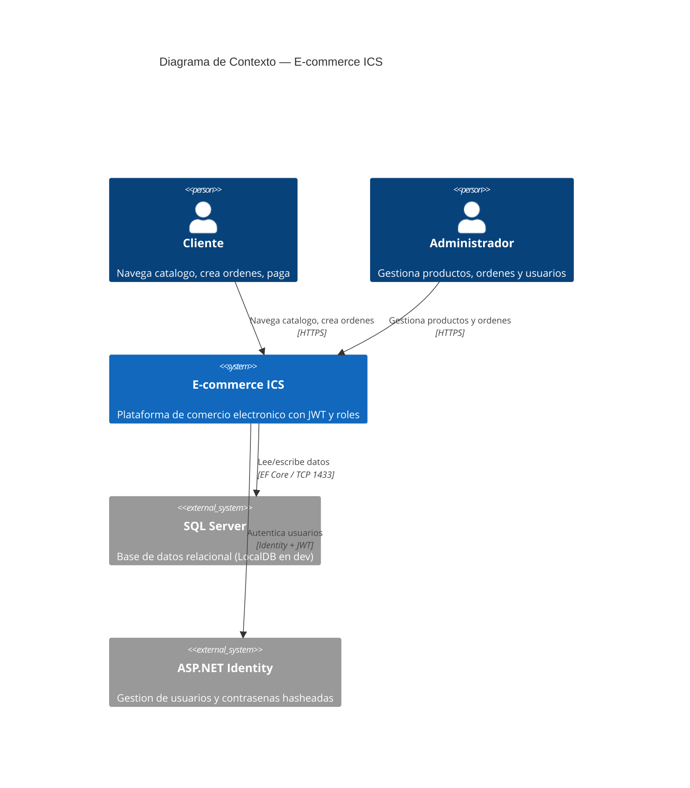
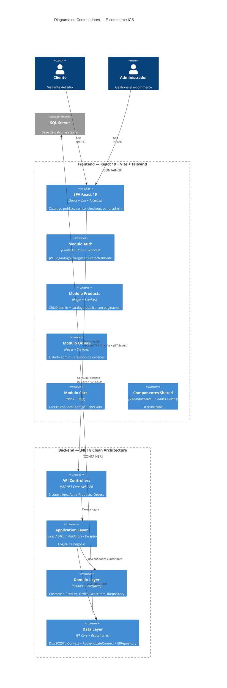
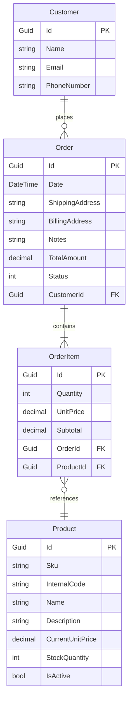

# TP1 — Auditoria Tecnica y Plan de Refactorizacion

**Materia:** Ingenieria y Calidad del Software
**Proyecto:** E-commerce ICS (React 19 + .NET 8 + SQL Server)
**Fecha:** 2026
**Estado:** Actualizado — basado en analisis del codigo fuente real

---

## 1. Diagrama de Arquitectura — C4 Model (Nivel 1: Contexto)



---

## 2. Diagrama de Arquitectura — C4 Model (Nivel 2: Contenedores)



---

## 3. Modelado de Dominio

### 3.1 Estado Actual — Entidades Implementadas

Archivos en `Domain/Entities/`:

```
Domain/Entities/
├── EntityBase.cs         ← Base abstracta (Guid Id)
├── Customer.cs           ← Name, Email, PhoneNumber
├── Product.cs            ← SKU, Name, Price, Stock, IsActive
├── Order.cs              ← Date, Addresses, Status, FK->Customer
├── OrderItem.cs          ← Qty, Price, FK->Order, FK->Product
└── OrderStatus.cs        ← Enum: PENDING..CANCELLED
```

Estado de las capas:

| Capa | Archivo | Estado |
|------|---------|--------|
| Domain | EntityBase.cs | Implementado |
| Domain | IRepository.cs | Generico CRUD |
| Domain | Customer.cs | Implementado |
| Domain | Product.cs | Implementado |
| Domain | Order.cs | Implementado |
| Domain | OrderItem.cs | Implementado |
| Domain | OrderStatus.cs | Implementado |
| Data | Dsw2025TpiContext.cs | Configurado (Fluent API, 4 DbSets) |
| Data | AuthenticateContext.cs | Configurado (IdentityDbContext) |
| Data | EfRepository.cs | Implementado |
| Data | Migraciones | 3 migraciones (2 Business + 1 Identity) |
| Data | Seed data | Products.json, Customers.json, Orders.json |
| Application | ProductsManagementServices.cs | Implementado |
| Application | OrdersManagementServices.cs | Implementado |
| Application | JwtTokenService.cs | Implementado |
| Application | DTOs (6 archivos) | Implementados |
| Application | Validators (4 archivos) | Estaticos, manuales |
| Application | Exceptions (3 archivos) | Implementadas |
| Api | AuthenticateController.cs | Login + Register |
| Api | ProductsController.cs | CRUD + Admin list |
| Api | OrderController.cs | CRUD + Status update |

### 3.2 Modelo de Dominio — Entidades Reales

#### Diagrama ER (Implementado)



Relaciones:
- Customer 1--* Order (un cliente tiene muchas ordenes)
- Order 1--* OrderItem (una orden tiene muchos items)
- OrderItem *--1 Product (un item referencia un producto)

Computed properties:
- Order.TotalAmount => OrderItems.Sum(x => x.Subtotal)
- OrderItem.Subtotal => Quantity * UnitPrice

### 3.3 Comparativa: Plan vs Implementacion

| Aspecto | Plan original | Implementacion actual |
|---------|---------------|----------------------|
| Entidad de usuario | User (custom) | IdentityUser (ASP.NET Identity) + Customer (espejo) |
| Roles | Enteros (0=Admin, 1=Client) | Strings ("Admin", "User") via Identity |
| Categorias | Entidad Category con FK en Product | No implementada |
| PaymentMethod | Entidad separada | No implementada |
| ShippingAddress | Value Object embebido | Campo string? simple en Order |
| BillingInfo | Value Object embebido | Campo string? simple en Order |
| OrderNumber | Campo unico | No existe (se usa Id como identificador) |

---

## 4. Auditoria Tecnica — Hallazgos

### SEGURIDAD

---

### Hallazgo AT-01 — JWT secret key en appsettings.json (CRITICO)

**Ubicacion:** Dsw2025Tpi.Api/appsettings.json linea 11

**Tipo:** Seguridad (Critical — Secret Exposed)

**Descripcion:**
La clave secreta para firmar JWT esta hardcodeada en appsettings.json y commiteada al repositorio. Cualquier persona con acceso al repo puede forjar tokens validos.

**Evidencia:**

```json
"Jwt": {
    "Key": "clave_super_secreta_12345678910211123123123123213123"
}
```

**Consecuencias:**
- Cualquiera con acceso al repo puede generar tokens JWT validos
- Suplantacion de identidad trivial
- Compromiso total del sistema de autenticacion

**Recomendacion:** Mover a User Secrets en desarrollo, Azure Key Vault o Variables de Entorno en produccion.

**Impacto:** Critico | **Esfuerzo:** Bajo (~15 min)

---

### Hallazgo AT-02 — Credenciales admin en plaintext (CRITICO)

**Ubicacion:** Dsw2025Tpi.Api/appsettings.json linea 24-27

**Tipo:** Seguridad (Critical — Credentials Exposed)

**Descripcion:**
Las credenciales del usuario admin por defecto estan en texto plano en el archivo de configuracion.

**Evidencia:**

```json
"DefaultAdmin": {
    "Username": "admin",
    "Password": "SecurePassword123!",
    "Role": "Admin"
}
```

**Consecuencias:**
- Cualquiera con acceso al repo tiene las credenciales de admin
- En produccion, acceso total al sistema

**Recomendacion:** Mover a User Secrets / Variables de Entorno. Generar password aleatorio en la primera ejecucion.

**Impacto:** Critico | **Esfuerzo:** Bajo (~15 min)

---

### Hallazgo AT-03 — Sin rate limiting en login/register (ALTO)

**Ubicacion:** Dsw2025Tpi.Api/Program.cs

**Tipo:** Seguridad (High — Brute Force Vulnerable)

**Descripcion:**
No hay rate limiting configurado. Los endpoints de login y register son vulnerables a ataques de fuerza bruta.

**Consecuencias:**
- Ataques de fuerza bruta contra contrasenas de usuarios
- Abuso de endpoint de registro para crear cuentas masivas
- Negacion de servicio por carga excesiva

**Recomendacion:** Configurar Microsoft.AspNetCore.RateLimiting con limites estrictos en auth endpoints.

**Impacto:** Alto | **Esfuerzo:** Medio (~1-2 horas)

---

### Hallazgo AT-04 — Token en localStorage vulnerable a XSS (ALTO)

**Ubicacion:** Frontend — auth/context/AuthProvider.jsx

**Tipo:** Seguridad (High — XSS Vulnerability)

**Descripcion:**
El JWT se almacena en localStorage, accesible por cualquier script que se ejecute en la pagina.

**Evidencia:**

```javascript
localStorage.setItem('token', data);
const token = localStorage.getItem('token');
config.headers.Authorization = `Bearer ${token}`;
```

**Consecuencias:** Robo de sesion via XSS, suplantacion de identidad.

**Recomendacion:** Mover a HttpOnly cookie o implementar BFF pattern.

**Impacto:** Alto | **Esfuerzo:** Medio (~2-3 horas)

---

### Hallazgo AT-05 — Password policy debil (MEDIA)

**Ubicacion:** Program.cs linea 74-77

**Tipo:** Seguridad (Medium — Weak Password Policy)

**Descripcion:**
La politica de contrasenas solo requiere longitud 8, sin reglas de complejidad.

**Evidencia:**

```csharp
options.Password.RequiredLength = 8;
// No hay: RequireDigit, RequireLowercase, RequireUppercase, RequireNonAlphanumeric
```

**Consecuencias:** Contrasenas debiles como "12345678" son validas.

**Recomendacion:** Agregar RequireDigit, RequireUppercase, RequireLowercase, RequireNonAlphanumeric.

**Impacto:** Medio | **Esfuerzo:** Bajo (~15 min)

---

### ARQUITECTURA

---

### Hallazgo AT-06 — Dependencia circular Application -> Data (ALTO)

**Ubicacion:** Dsw2025Tpi.Application/Dsw2025Tpi.Application.csproj

**Tipo:** Arquitectura (High — Clean Architecture Violation)

**Descripcion:**
La capa Application referencia directamente a la capa Data, lo cual viola Clean Architecture. Application solo deberia depender de Domain (interfaces).

```
Flujo correcto:  Api -> Application -> Domain <- Data
Flujo actual:    Api -> Application -> Data -> Domain
```

**Consecuencias:**
- Application no puede ser reutilizada sin Data
- Dificulta testing (no se puede mockear el repositorio facilmente)
- Violacion del Dependency Inversion Principle (DIP)

**Recomendacion:** Application solo debe referenciar Domain. El registro de implementaciones concretas (EfRepository) se hace en Api/Program.cs via DI.

**Impacto:** Alto | **Esfuerzo:** Medio (~1-2 horas)

---

### Hallazgo AT-07 — Sin Unit of Work (ALTO)

**Ubicacion:** Dsw2025Tpi.Data/Repositories/EfRepository.cs

**Tipo:** Arquitectura (High — Missing Atomicity Pattern)

**Descripcion:**
Cada operacion del repositorio invoca SaveChangesAsync() individualmente. No hay transacciones que agrupen multiples operaciones.

**Evidencia:**

```csharp
public async Task<T> Add<T>(T entity) where T : EntityBase
{
    await _context.AddAsync(entity);
    await _context.SaveChangesAsync();  // Commit inmediato
    return entity;
}
```

**Consecuencias:**
- La creacion de una orden (que decrementa stock de N productos) no es atomica
- Si falla la mitad del proceso, la BD queda en estado inconsistente
- Riesgo de datos corruptos en produccion

**Recomendacion:** Implementar IUnitOfWork con SaveChangesAsync() centralizado. Los servicios llaman a unitOf
Work.SaveChangesAsync() al final.

**Impacto:** Alto | **Esfuerzo:** Medio (~2-3 horas)

---

### Hallazgo AT-08 — BaseController.cs es codigo muerto (BAJO)

**Ubicacion:** Dsw2025Tpi.Api/Controllers/BaseController.cs

**Tipo:** Calidad (Low — Dead Code)

**Descripcion:**
BaseController es una clase abstracta que hereda de Controller y sobreescribe OnActionExecuted. Ningun controller del proyecto la usa — todos heredan de ControllerBase.

**Consecuencias:** Codigo muerto que genera confusion.

**Recomendacion:** Eliminar BaseController.cs.

**Impacto:** Bajo | **Esfuerzo:** Bajo (~5 min)

---

### Hallazgo AT-09 — Sin global exception handling middleware (ALTO)

**Ubicacion:** Dsw2025Tpi.Api/Program.cs

**Tipo:** Arquitectura (High — Missing Cross-Cutting Concern)

**Descripcion:**
No hay middleware de manejo de excepciones global. Cada controller tiene su propio try/catch con patrones inconsistentes.

**Consecuencias:**
- Errores no controlados retornan 500 con stack trace (en dev)
- Sin formato consistente de errores
- El frontend tiene mapeo de errores que puede no funcionar

**Recomendacion:** Crear GlobalExceptionMiddleware que capture excepciones y las transforme en respuestas ProblemDetails consistentes.

**Impacto:** Alto | **Esfuerzo:** Medio (~2 horas)

---

### CODIGO

---

### Hallazgo AT-10 — Bug: BillingAddress.HasPrecision(15,2) en DbContext (MEDIO)

**Ubicacion:** Dsw2025Tpi.Data/Dsw2025TpiContext.cs linea 46

**Tipo:** Bug (Medium — Semantic Error)

**Descripcion:**
El campo BillingAddress es de tipo string pero tiene configurado HasPrecision(15,2), que es para campos numericos/decimales.

**Evidencia:**

```csharp
entity.Property(e => e.BillingAddress).HasMaxLength(60).HasPrecision(15, 2);
```

**Consecuencias:** Configuracion semantica incorrecta. Puede causar comportamiento inesperado en EF Core.

**Recomendacion:** Eliminar HasPrecision(15,2) de BillingAddress. Solo mantener HasMaxLength(60).

**Impacto:** Medio | **Esfuerzo:** Bajo (~5 min)

---

### Hallazgo AT-11 — Bug: Order.Date.HasMaxLength(10) en DbContext (BAJO)

**Ubicacion:** Dsw2025Tpi.Data/Dsw2025TpiContext.cs linea 41

**Tipo:** Bug (Low — Meaningless Configuration)

**Descripcion:**
El campo Date es de tipo DateTime pero tiene HasMaxLength(10), que es sin sentido para un campo de fecha.

**Evidencia:**

```csharp
entity.Property(e => e.Date).HasMaxLength(10);
```

**Consecuencias:** Configuracion sin efecto practico, genera confusion.

**Recomendacion:** Eliminar HasMaxLength(10) de Order.Date.

**Impacto:** Bajo | **Esfuerzo:** Bajo (~5 min)

---

### Hallazgo AT-12 — Sin unique index en Product.Sku (ALTO)

**Ubicacion:** Dsw2025Tpi.Data/Dsw2025TpiContext.cs

**Tipo:** Seguridad de datos (High — Race Condition)

**Descripcion:**
El servicio verifica unicidad de SKU en codigo, pero no hay constraint de unique en la base de datos. Dos requests concurrentes pueden crear productos con el mismo SKU.

**Consecuencias:**
- Race condition: dos productos con mismo SKU
- Datos inconsistentes en la BD

**Recomendacion:** Agregar `entity.HasIndex(p => p.Sku).IsUnique()` en OnModelCreating.

**Impacto:** Alto | **Esfuerzo:** Bajo (~15 min)

---

### Hallazgo AT-13 — GUIDs duplicados en seed data (MEDIO)

**Ubicacion:** Dsw2025Tpi.Data/Sources/Products.json lineas 2 y 21

**Tipo:** Bug (Medium — Duplicate Seed Data)

**Descripcion:**
Dos productos en Products.json tienen el mismo GUID: b9ed5544-42dc-439c-b4d7-15e720089caa

**Consecuencias:**
- El segundo producto no se inserta (el GUID ya existe)
- Seed data incompleto

**Recomendacion:** Asignar GUIDs unicos a cada producto en el seed data.

**Impacto:** Medio | **Esfuerzo:** Bajo (~5 min)

---

### Hallazgo AT-14 — Typo TotatAmount en DTO y frontend (MEDIO)

**Ubicacion:** Application/Dtos/OrderModel.cs linea 13, Frontend orders/pages/ListOrdersPage.jsx linea 116

**Tipo:** Calidad (Medium — Typo Propagated)

**Descripcion:**
El DTO tiene la propiedad llamada TotatAmount en lugar de TotalAmount. El frontend trabaja con este typo.

**Evidencia:**

```csharp
// Backend: OrderModel.cs
public decimal TotatAmount { get; init; }

// Frontend: ListOrdersPage.jsx
order.totatAmount?.toFixed(2)
```

**Consecuencias:**
- Codigo confuso para nuevos developers
- El typo se propaga entre frontend y backend

**Recomendacion:** Renombrar a TotalAmount en ambos lados.

**Impacto:** Medio | **Esfuerzo:** Bajo (~15 min)

---

### FRONTEND

---

### Hallazgo AT-15 — createOrder.js rompe contrato {data, error} (ALTO)

**Ubicacion:** Frontend — orders/services/createOrder.js

**Tipo:** Calidad (High — Inconsistent Contract)

**Descripcion:**
Todos los servicios retornan {data, error} via handleApiCall. createOrder.js retorna solo {data} en exito y {error} en fallo, sin la clave error en exito ni data en fallo.

**Consecuencias:**
- Funciona por accidente (undefined es falsy)
- Rompera si alguien agrega chequeo explicito error === null

**Recomendacion:** Unificar todos los servicios para usar handleApiCall consistentemente.

**Impacto:** Alto | **Esfuerzo:** Bajo (~15 min)

---

### Hallazgo AT-16 — useCart no es shared state (ALTO)

**Ubicacion:** Frontend — cart/hooks/useCart.js

**Tipo:** Arquitectura (High — State Management Issue)

**Descripcion:**
Cada llamada a useCart() crea una instancia independiente de estado con su propio useState + useEffect. No hay Context como AuthContext.

**Consecuencias:**
- El badge del carrito en el header no se actualiza al agregar items
- Cada componente tiene su propia copia del carrito
- Estado desincronizado entre paginas

**Recomendacion:** Envolver useCart en un Context (similar a AuthContext) para estado global.

**Impacto:** Alto | **Esfuerzo:** Medio (~1-2 horas)

---

### Hallazgo AT-17 — window.dispatchEvent para comunicacion entre componentes (MEDIO)

**Ubicacion:** Frontend — LoginModal.jsx, RegisterModal.jsx, ListProductsUserPage.jsx, CartPage.jsx

**Tipo:** Calidad (Medium — Anti-Pattern)

**Descripcion:**
Los modales de login y register se comunican via window.dispatchEvent('open-login') / window.dispatchEvent('open-register'). Esto bypassa el flujo de datos de React.

**Consecuencias:**
- Invisible en React DevTools
- Imposible de testear
- Acoplamiento invisible entre componentes

**Recomendacion:** Usar Context o estado levantado en un componente padre comun.

**Impacto:** Medio | **Esfuerzo:** Medio (~1 hora)

---

### Hallazgo AT-18 — Interceptor usa window.location.href (MEDIO)

**Ubicacion:** Frontend — shared/api/axiosInstance.js lineas 21-36

**Tipo:** Calidad (Medium — Tight Coupling)

**Descripcion:**
El interceptor de respuesta hace window.location.href = '/login' en 401 para rutas admin, causando reload completo de la SPA.

**Consecuencias:**
- Cada expiracion de token pierde todo el estado en memoria de React
- El interceptor conoce la estructura de rutas (acoplado a /admin/)

**Recomendacion:** Inyectar navegacion via callback o usar el contexto de auth para notificar el 401.

**Impacto:** Medio | **Esfuerzo:** Medio (~1-2 horas)

---

### Hallazgo AT-19 — listServices.js tiene fallback fetch mixto con Axios (MEDIO)

**Ubicacion:** Frontend — orders/services/listServices.js lineas 16-38

**Tipo:** Calidad (Medium — Inconsistent Pattern)

**Descripcion:**
Este servicio tiene un fallback manual de fetch() despues de que Axios falla. Ningun otro servicio hace esto. Es probablemente un artefacto de debugging.

**Consecuencias:**
- Dos patrones de acceso a datos en el mismo proyecto
- El fallback no usa handleApiCall, retorna forma diferente de datos
- En produccion puede fallar si no hay proxy de Vite

**Recomendacion:** Eliminar el fallback fetch. Usar solo la instancia de Axios.

**Impacto:** Medio | **Esfuerzo:** Bajo (~15 min)

---

### Hallazgo AT-20 — withCredentials innecesario en Axios (BAJO)

**Ubicacion:** Frontend — shared/api/axiosInstance.js linea 5

**Tipo:** Seguridad (Low — Unnecessary Configuration)

**Descripcion:**
La instancia Axios se configura con withCredentials: true, pero el backend usa Bearer token, no cookies.

**Consecuencias:** Envio innecesario de cookies, potencial vector CSRF.

**Recomendacion:** Eliminar withCredentials: true o hacerlo condicional.

**Impacto:** Bajo | **Esfuerzo:** Bajo (~5 min)

---

### Hallazgo AT-21 — Imagenes hardcoded externas y base64 inline (BAJO)

**Ubicacion:** Frontend — UserHeaderMenu.jsx linea 88, MobileSideMenu.jsx linea 32, CartPage.jsx linea 101, ListProductsUserPage.jsx linea 16

**Tipo:** Calidad (Low — External Dependencies)

**Descripcion:**
Hay imagenes de CDN externo (freepik, flaticon) y un base64 de 400+ chars inline en el componente.

**Consecuencias:**
- No funciona offline
- Dependencia de CDNs de terceros
- Bundle inflado por base64 inline

**Recomendacion:** Mover todas las imagenes a assets/ local.

**Impacto:** Bajo | **Esfuerzo:** Bajo (~30 min)

---

### Hallazgo AT-22 — SweetAlert2 instalado pero nunca usado (BAJO)

**Ubicacion:** Frontend — package.json

**Tipo:** Calidad (Low — Dead Dependency)

**Descripcion:**
SweetAlert2 esta en las dependencias pero nunca se importa en ningun archivo del source.

**Consecuencias:** Bundle size inflado innecesariamente.

**Recomendacion:** Eliminar de package.json: npm uninstall sweetalert2.

**Impacto:** Bajo | **Esfuerzo:** Bajo (~5 min)

---

### Hallazgo AT-23 — Typo en nombre de archivo ProducstManagementServices (BAJO)

**Ubicacion:** Dsw2025Tpi.Application/Services/ProducstManagementServices.cs

**Tipo:** Calidad (Low — Filename Typo)

**Descripcion:**
El archivo se llama ProducstManagementServices.cs en lugar de ProductsManagementServices.cs.

**Consecuencias:** Confusion al buscar archivos.

**Recomendacion:** Renombrar el archivo.

**Impacto:** Bajo | **Esfuerzo:** Bajo (~5 min)

---

### Hallazgo AT-24 — Inconsistencia en tipos de excepciones entre validadores (BAJO)

**Ubicacion:** Dsw2025Tpi.Application/Validation/

**Tipo:** Calidad (Low — Inconsistent Error Handling)

**Descripcion:**
Cada validador lanza un tipo de excepcion diferente:
- ProductValidator: ApplicationException para la mayoria, ArgumentException para stock
- OrderValidator: InvalidOperationException
- CustomerValidator: InvalidOperationException
- OrderItemValidator: no es llamado desde OrderValidator

**Consecuencias:**
- El controller tiene que catchear multiples tipos de excepcion
- Logica de manejo de errores dispersa e inconsistente

**Recomendacion:** Estandarizar un solo tipo de excepcion de validacion (ej: ValidationException) o usar el ApplicationException existente.

**Impacto:** Bajo | **Esfuerzo:** Bajo (~30 min)

---

### Hallazgo AT-25 — OrderItemValidator no es llamado (MEDIO)

**Ubicacion:** Dsw2025Tpi.Application/Validation/OrderItemValidator.cs, OrdersManagementServices.cs

**Tipo:** Bug (Medium — Validation Bypass)

**Descripcion:**
El OrderItemValidator existe pero no es invocado desde OrderValidator.Validate() ni desde OrdersManagementService.AddOrder(). La validacion de items individuales se salta.

**Consecuencias:**
- Items con cantidad <= 0 o precio < 0 pueden llegar a la BD
- La validacion por item no se ejecuta

**Recomendacion:** Llamar a OrderItemValidator.Validate() por cada item en OrderValidator o en el servicio.

**Impacto:** Medio | **Esfuerzo:** Bajo (~15 min)

---

### Hallazgo AT-26 — Base de datos LocalDB no apta para produccion (ALTO)

**Ubicacion:** Dsw2025Tpi.Api/appsettings.json linea 2, DB_Config.md

**Tipo:** Infraestructura (High — Not Production Ready)

**Descripcion:**
El backend usa `(localdb)\MSSQLLocalDB` con Integrated Security (Windows Authentication). LocalDB tiene limitaciones significativas que lo hacen inadecuado para cualquier entorno que no sea desarrollo local en Windows:

- **Solo Windows** — no funciona en Linux ni Mac
- **Un usuario a la vez** — named pipes, no acepta conexiones TCP simultaneas
- **Inestable** — el motor se inicia/detiene automaticamente, fallos frecuentes
- **Sin autenticacion por usuario** — usa Windows Auth, imposible configurar User/Password
- **No apto para Docker** — no se puede empaquetar en contenedor
- **10 GB max** — limite de base de datos
- **Rendimiento limitado** — no soporta carga real

**Evidencia:**

```json
"ConnectionStrings": {
    "Dsw2025Tpi": "Data Source=(localdb)\\MSSQLLocalDB;Initial Catalog=Dsw2025Tpi;Integrated Security=True;"
}
```

**Consecuencias:**
- Imposible desplegar en entorno Docker o contenedor
- Colaboradores con Mac/Linux no pueden ejecutar el backend
- Inestabilidad en el desarrollo diario (fallos de conexion)
- No refleja el entorno de produccion (SQL Server real)

**Recomendacion:** Migrar a Docker SQL Server 2022 (`mcr.microsoft.com/mssql/server:2022-latest`) con autenticacion SQL (User/Password). Ver `PLAN.md` Fase 0 para el plan detallado de migracion.

**Impacto:** Alto | **Esfuerzo:** Medio (~30 min)

---

## 5. Matriz de Priorizacion — Esfuerzo vs Impacto

| | Impacto Bajo | Impacto Alto | Impacto Muy Alto | Impacto Critico |
|---|---|---|---|---|
| **Esfuerzo Bajo** | AT-08, AT-11, AT-20, AT-21, AT-22, AT-23, AT-24 | AT-15, AT-19, AT-25 | AT-10, AT-12, AT-13, AT-14 | AT-01, AT-02, AT-05 |
| **Esfuerzo Medio** | — | AT-17, AT-18, **AT-26** | AT-06, AT-07, AT-09, AT-16 | AT-03, AT-04 |

### Leyenda de prioridad

- **P1 — Critico (hacer ya):** AT-01 + AT-02 — Secret y credenciales expuestas. Si el repo es publico, el sistema esta comprometido.
- **P2 — Hacer pronto:** AT-03 + AT-05 — Rate limiting y password policy. Seguridad basica.
- **P3 — Hacer pronto:** AT-06 + AT-07 + AT-09 — Arquitectura: circular dep, UoW, exception handling.
- **P4 — Planificar:** AT-12 + AT-14 + AT-15 + AT-16 + AT-25 + **AT-26** — Bugs, calidad de codigo, e infraestructura de BD.
- **P5 — Mejoras:** AT-04 + AT-17 + AT-18 + AT-19 — Frontend patterns.
- **P6 — Bajo:** AT-08, AT-10, AT-11, AT-20, AT-21, AT-22, AT-23, AT-24 — Limpieza y cosmetica.

---

## 6. Plan de Refactorizacion — Backlog Priorizado

| # | Hallazgo | Accion | Esfuerzo | Impacto | Prioridad |
|---|---|---|---|---|---|
| 1 | AT-01 | Mover JWT secret a User Secrets / Env Vars | Bajo | Critico | P1 |
| 2 | AT-02 | Mover credenciales admin a User Secrets / Env Vars | Bajo | Critico | P1 |
| 3 | AT-05 | Fortalecer password policy (complejidad) | Bajo | Medio | P2 |
| 4 | AT-03 | Agregar rate limiting en login/register | Medio | Alto | P2 |
| 5 | AT-06 | Corregir dependencia circular Application->Data | Medio | Alto | P3 |
| 6 | AT-07 | Implementar Unit of Work | Medio | Alto | P3 |
| 7 | AT-09 | Crear GlobalExceptionMiddleware | Medio | Alto | P3 |
| 8 | AT-12 | Agregar unique index en Product.Sku | Bajo | Alto | P4 |
| 9 | AT-14 | Corregir typo TotatAmount -> TotalAmount | Bajo | Medio | P4 |
| 10 | AT-15 | Unificar createOrder.js con handleApiCall | Bajo | Alto | P4 |
| 11 | AT-16 | Convertir useCart a Context para shared state | Medio | Alto | P4 |
| 12 | AT-25 | Llamar OrderItemValidator desde OrderValidator | Bajo | Medio | P4 |
| 13 | AT-10 | Corregir BillingAddress.HasPrecision en DbContext | Bajo | Medio | P4 |
| 14 | AT-04 | Mover token a HttpOnly cookie (o BFF pattern) | Medio | Alto | P5 |
| 15 | AT-17 | Reemplazar window.dispatchEvent por Context | Medio | Medio | P5 |
| 16 | AT-18 | Desacoplar interceptor de navegacion | Medio | Medio | P5 |
| 17 | AT-19 | Eliminar fallback fetch en listServices.js | Bajo | Medio | P5 |
| 18 | AT-08 | Eliminar BaseController.cs (codigo muerto) | Bajo | Bajo | P6 |
| 19 | AT-11 | Eliminar HasMaxLength(10) de Order.Date | Bajo | Bajo | P6 |
| 20 | AT-20 | Eliminar withCredentials: true | Bajo | Bajo | P6 |
| 21 | AT-13 | Corregir GUIDs duplicados en Products.json | Bajo | Medio | P6 |
| 22 | AT-21 | Mover imagenes CDN a assets/ local | Bajo | Bajo | P6 |
| 23 | AT-22 | Eliminar SweetAlert2 (no usado) | Bajo | Bajo | P6 |
| 24 | AT-23 | Renombrar ProducstManagementServices.cs | Bajo | Bajo | P6 |
| 25 | AT-24 | Estandarizar tipos de excepcion en validadores | Bajo | Bajo | P6 |
| 26 | **AT-26** | **Migrar de LocalDB a Docker SQL Server** | **Medio** | **Alto** | **P4** |

---

## 7. Resumen Ejecutivo

### Estado del proyecto

El proyecto tiene una base solida implementada: Clean Architecture en 4 capas, entidades de dominio, autenticacion JWT con ASP.NET Identity, controllers, servicios, DTOs, y un frontend funcional con 6 modulos (auth, products, orders, cart, home, shared).

**Infraestructura de BD:** Actualmente usa LocalDB (limitado, solo Windows). Se recomienda migrar a Docker SQL Server (ver AT-26 y PLAN.md Fase 0).

### Deuda tecnica total identificada: 26 hallazgos

| Severidad | Cantidad | Hallazgos |
|-----------|----------|-----------|
| Critica | 2 | AT-01 (JWT secret), AT-02 (admin creds) |
| Alta | 6 | AT-03, AT-04, AT-06, AT-07, AT-09, AT-26 |
| Media | 8 | AT-05, AT-10, AT-13, AT-14, AT-16, AT-17, AT-18, AT-19, AT-25 |
| Baja | 10 | AT-08, AT-11, AT-12, AT-20, AT-21, AT-22, AT-23, AT-24 |

### Esfuerzo total estimado para resolver todo: ~16-21 horas

### Prioridad inmediata (proximas 2-3 horas):
1. Mover secret y credenciales a variables de entorno
2. Fortalecer password policy
3. Agregar rate limiting
4. Corregir bugs en DbContext
5. Agregar unique index en SKU
6. Corregir typo TotatAmount
7. **Migrar de LocalDB a Docker SQL Server** (ver PLAN.md Fase 0)
