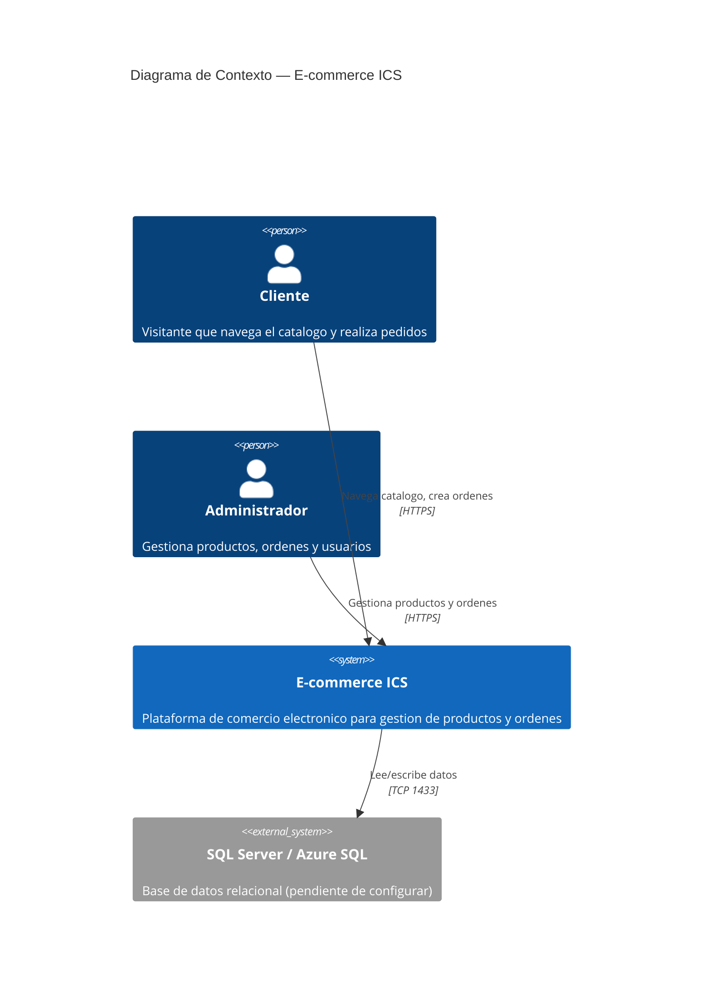
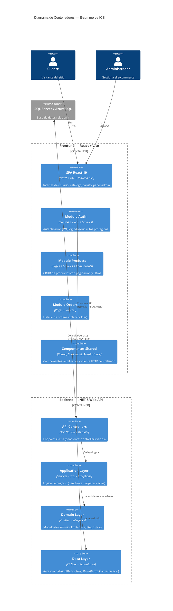
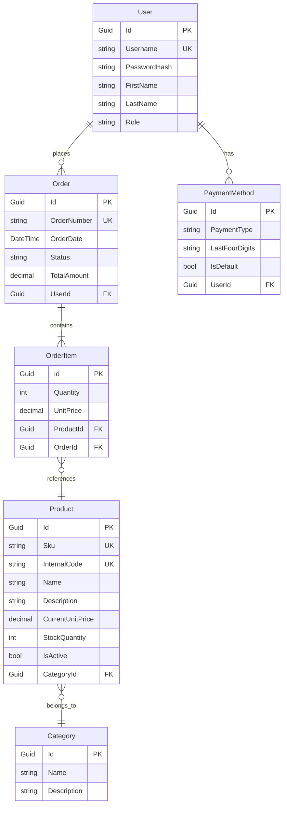

# TP1 — Diagnostico de Deuda Tecnica y Plan de Refactorizacion

**Materia:** Ingenieria y Calidad del Software
**Proyecto:** E-commerce ICS (React + .NET 8 + SQL Server)
**Fecha:** 2026

---

## 1. Diagrama de Arquitectura — C4 Model (Nivel 1: Contexto)



---

## 2. Diagrama de Arquitectura — C4 Model (Nivel 2: Contenedores)



---

## 3. Modelado de Dominio

---

### 3.1 Estado Actual — Lo que existe hoy

Solo existe una entidad base abstracta. **No hay entidades concretas implementadas.**

**Archivos en `Domain/Entities/`:**
```
Domain/Entities/
└── EntityBase.cs    ← Único archivo existente
```

```csharp
// Domain/Entities/EntityBase.cs (EXISTENTE)
public abstract class EntityBase
{
    protected EntityBase()
    {
        Id = Guid.NewGuid();
    }
    public Guid Id { get; }
}
```

**Estado de las capas relacionadas:**

| Capa | Archivo | Estado |
|------|---------|--------|
| Domain | `EntityBase.cs` | ✅ Implementado |
| Domain | `IRepository.cs` | ✅ Implementado (genérico) |
| Data | `Dsw2025TpiContext.cs` | ❌ Vacío (sin DbSet) |
| Data | `EfRepository.cs` | ✅ Implementado (pero inoperable sin contexto) |
| Application | `Services/` | ❌ Vacío |
| Api | `Controllers/` | ❌ Vacío |

**Conclusión:** El repositorio genérico está listo pero no puede funcionar porque no hay entidades ni contexto configurado.

---

### 3.2 Modelo Objetivo — Hacia dónde apuntamos

Basado en los requisitos del e-commerce (ver `README.md` sección "Requisitos"), el modelo de dominio debería tener estas entidades:

#### Diagrama ER (Objetivo)



#### Tabla resumen de entidades

| Entidad | Propiedades principales | Restricciones | Relaciones |
|---------|------------------------|---------------|------------|
| **User** | Username, PasswordHash, FirstName, LastName, Role | Username único, Role = "Admin" o "Client" | 1→N Order, 1→N PaymentMethod |
| **Product** | Sku, InternalCode, Name, Description, CurrentUnitPrice, StockQuantity, IsActive, CategoryId | Sku único, InternalCode único, Precios ≥ 0, Stock ≥ 0 | N→1 Category, 1→N OrderItem |
| **Category** | Name, Description | Name único | 1→N Product |
| **Order** | OrderNumber, OrderDate, Status, TotalAmount, UserId | OrderNumber único, TotalAmount ≥ 0 | N→1 User, 1→N OrderItem, OwnsOne ShippingAddress, OwnsOne BillingInfo |
| **OrderItem** | Quantity, UnitPrice, ProductId, OrderId | Quantity ≥ 1, UnitPrice ≥ 0 | N→1 Order, N→1 Product |
| **PaymentMethod** | PaymentType, LastFourDigits, IsDefault, UserId | PaymentType = "CreditCard"/"Debit"/"Cash" | N→1 User |

#### Value Objects embebidos en Order

**ShippingAddress** (dirección de envío):

| Campo | Tipo | Descripción |
|-------|------|-------------|
| Street | string | Dirección |
| City | string | Ciudad |
| State | string | Provincia |
| ZipCode | string | Código postal |
| Country | string | País |

**BillingInfo** (información de facturación):

| Campo | Tipo | Descripción |
|-------|------|-------------|
| TaxId | string | CUIT/CUIL |
| BillingName | string | Razón social |
| BillingAddress | string | Dirección de facturación |

> Se recomienda embeber como `Owned Entity Type` con `OwnsOne()` en Fluent API (una tabla menos en la BD).

#### Estados de una Order

```
Pending → Confirmed → Shipped → Delivered
    ↓
 Cancelled
```

| Estado | Descripción |
|--------|-------------|
| Pending | Creada, esperando confirmación |
| Confirmed | Aceptada, stock descontado |
| Shipped | En camino |
| Delivered | Entregada al cliente |
| Cancelled | Cancelada |

#### Archivos a crear en `Domain/Entities/`

```
Domain/Entities/
├── EntityBase.cs         ← Ya existe
├── User.cs               ← Nuevo
├── Product.cs            ← Nuevo
├── Category.cs           ← Nuevo
├── Order.cs              ← Nuevo (con ShippingAddress y BillingInfo)
├── OrderItem.cs          ← Nuevo
└── PaymentMethod.cs      ← Nuevo
```

---

### 3.3 Comparativa: Actual vs. Objetivo

| Aspecto | Actual | Objetivo |
|---------|--------|----------|
| Entidades | Solo `EntityBase` | 6 entidades concretas + 2 Value Objects |
| DbContext | Vacío | 6 `DbSet<T>` + `OnModelCreating` |
| Relaciones | No definidas | Configuradas con Fluent API |
| Migraciones | No existen | Migración inicial |
| Tablas en BD | No hay | 6 tablas (+ tablas embebidas) |

---

## 4. Auditoria Tecnica — Hallazgos (Backend)

---

### Hallazgo AT-01 — DbContext completamente vacio (Backend)

**Ubicacion:** Capa de Datos | Dsw2025Tpi.Data | Dsw2025TpiContext.cs

**Tipo:** Mantenibilidad / Calidad (Code Smell — Empty Class)

**Descripcion:**
El DbContext de Entity Framework Core esta completamente vacio. No contiene DbSet para ninguna entidad, no tiene OnModelCreating, y no recibe DbContextOptions en el constructor. Toda la capa de persistencia es inoperable.

**Evidencia simplificada:**

```csharp
// Dsw2025Tpi.Data/Dsw2025TpiContext.cs
using Microsoft.EntityFrameworkCore;

namespace Dsw2025Tpi.Data;

public class Dsw2025TpiContext: DbContext
{
}
```

**Problema identificado:**
El repositorio generico EfRepository depende de `_context.Set<T>()` y `_context.SaveChangesAsync()`, pero el contexto no tiene configuracion de tablas, relaciones ni cadena de conexion. Todo metodo invocado desde el repositorio lanzara una excepcion en runtime.

**Consecuencias:**
- El CRUD implementado en EfRepository es completamente inoperable
- No se puede persistir ni consultar ningun dato
- La capa de datos es solo una estructura vacia sin valor funcional
- Si se intenta usar, se obtiene `InvalidOperationException: No database provider has been configured`

**Principios afectados:**
- **Interface Segregation Principle (ISP):** IRepository define operaciones que el contexto no puede soportar
- **Dependency Inversion Principle (DIP):** La abstraccion (IRepository) depende de una concrecion rota (Dsw2025TpiContext vacio)

**Recomendacion:**
Crear todas las entidades de dominio (Product, Order, User, etc.), configurar DbSet para cada una, implementar OnModelCreating con Fluent API para relaciones e indices, y agregar connection string en appsettings.json.

**Impacto:** Muy Alto
**Esfuerzo estimado:** Alto (~4-6 horas)

---

### Hallazgo AT-02 — Servicio de ordenes usa fetch() nativo en vez de Axios (Frontend)

**Ubicacion:** Capa de Servicios | modules/orders/services | listServices.js

**Tipo:** Mantenibilidad / Calidad (Code Smell — Duplicated Logic / Inconsistent Pattern)

**Descripcion:**
El servicio de ordenes utiliza fetch() nativo con configuracion manual de headers y token, mientras que todos los demas servicios del proyecto (login.js, list.js, create.js) utilizan la instancia centralizada de Axios configurada en axiosInstance.js.

**Evidencia simplificada:**

```javascript
// src/modules/orders/services/listServices.js
export const listOrders = async () => {
  const response = await fetch('/api/orders', {
    method: 'GET',
    headers: {
      'Content-Type': 'application/json',
      'Authorization': `Bearer ${localStorage.getItem('token')}`,
    },
  });
  // ...
};

// Comparar: src/modules/products/services/list.js (usa Axios)
import { instance } from '../../shared/api/axiosInstance';

export const getProducts = async (search, status, pageNumber, pageSize) => {
  const response = await instance.get(`api/products/admin?${queryString}`);
  return { data: response.data, error: null };
};
```

**Problema identificado:**
Dos caminos diferentes para hacer peticiones HTTP en el mismo proyecto. El interceptor de Axios que maneja el token automaticamente y el redirect en 401 no se aplica a listServices.js.

**Consecuencias:**
- Si cambia la forma de obtener el token (ej: httpOnly cookies), hay que actualizar listServices.js por separado
- El interceptor de Axios no captura errores 401 de las peticiones fetch
- Duplicacion de logica de autenticacion (el token se configura manualmente)
- Inconsistencia: dos patrones de acceso a datos en el mismo modulo

**Principios afectados:**
- **Don't Repeat Yourself (DRY):** Logica de headers de autenticacion duplicada
- **Single Source of Truth:** Dos mecanismos de comunicacion HTTP sin coordinacion

**Recomendacion:**
Reemplazar fetch() por `instance.get('/api/orders')` de la instancia de Axios ya configurada. Eliminar la configuracion manual de headers.

**Impacto:** Alto
**Esfuerzo estimado:** Bajo (~15 minutos)

---

### Hallazgo AT-03 — Interceptor de Axios con navegacion forzada via window.location.href (Frontend)

**Ubicacion:** Capa de Infraestructura HTTP | modules/shared/api | axiosInstance.js

**Tipo:** Diseno / Mantenibilidad (Code Smell — Tight Coupling / Violacion de Separation of Concerns)

**Descripcion:**
El interceptor de respuesta de Axios maneja errores 401 ejecutando `window.location.href = '/login'`, lo que provoca un reload completo de la aplicacion SPA. Ademas, tiene conocimiento hardcodeado de la estructura de rutas (`/admin/`).

**Evidencia simplificada:**

```javascript
// src/modules/shared/api/axiosInstance.js (lineas 21-35)
instance.interceptors.response.use(
  (config) => { return config; },
  (error) => {
    if (error.status === 401) {
      if (window.location.pathname.includes('/admin/')) {
        localStorage.clear();
        window.location.href = '/login';
      } else {
        localStorage.removeItem('token');
      }
    }
    return Promise.reject(error);
  },
);
```

**Problema identificado:**
Un modulo de infraestructura HTTP (axiosInstance.js) tiene conocimiento de la estructura de rutas de la aplicacion (`/admin/`) y ejecuta navegacion directa. Esto viola la separacion de capas y provoca un reload completo que pierde todo el estado en memoria de React.

**Consecuencias:**
- Cada expiracion de token provoca un reload completo del SPA
- Se pierde estado no persistido: formularios a medio llenar, filtros, scroll position
- El interceptor esta acoplado a rutas especificas — si cambia la navegacion, hay que modificar el interceptor
- Dificulta testing: no se puede mockear la navegacion

**Principios afectados:**
- **Separation of Concerns:** La capa HTTP no deberia conocer rutas ni ejecutar navegacion
- **Single Responsibility Principle:** El interceptor tiene dos responsabilidades: manejar errores HTTP y navegar
- **Open/Closed Principle:** Agregar una nueva ruta protegida requiere modificar el interceptor

**Recomendacion:**
Inyectar la funcion de navegacion del router (o un callback de logout) al crear la instancia de Axios, o usar el contexto de auth para notificar el error 401 y que el router maneje la redireccion.

**Impacto:** Alto
**Esfuerzo estimado:** Medio (~1-2 horas)

---

### Hallazgo AT-04 — EfRepository sin Unit of Work (Backend)

**Ubicacion:** Capa de Datos | Dsw2025Tpi.Data/Repositories | EfRepository.cs

**Tipo:** Diseno / Seguridad (Code Smell — Missing Pattern / Violacion de Atomicidad)

**Descripcion:**
Cada operacion del repositorio (Add, Update, Delete) invoca SaveChangesAsync() individualmente. No hay mecanismo para agrupar multiples operaciones en una transaccion atomica.

**Evidencia simplificada:**

```csharp
// Dsw2025Tpi.Data/Repositories/EfRepository.cs
public async Task<T> Add<T>(T entity) where T : EntityBase
{
    await _context.AddAsync(entity);
    await _context.SaveChangesAsync();  // Commit inmediato
    return entity;
}

public async Task<T> Delete<T>(T entity) where T : EntityBase
{
    _context.Remove(entity);
    await _context.SaveChangesAsync();  // Commit inmediato
    return entity;
}

public async Task<T> Update<T>(T entity) where T : EntityBase
{
    _context.Update(entity);
    await _context.SaveChangesAsync();  // Commit inmediato
    return entity;
}
```

**Problema identificado:**
Si una operacion de negocio requiere multiples cambios (ej: crear una orden + actualizar stock de 5 productos), cada cambio se confirma por separado. Si falla la mitad del proceso, la BD queda en estado inconsistente.

**Consecuencias:**
- No se puede garantizar atomicidad en operaciones compuestas
- Si falla la actualizacion del stock despues de crear la orden, la BD queda con una orden sin stock descontado
- El requisito de negocio "verificar stock antes de confirmar orden" no puede implementarse de forma segura
- Riesgo de datos corruptos en produccion

**Principios afectados:**
- **Unit of Work Pattern:** No implementado — cada operacion es una transaccion independiente
- **ACID (Atomicity):** La atomicidad no esta garantizada a nivel de aplicacion

**Recomendacion:**
Implementar IUnitOfWork con un SaveChangesAsync() centralizado. Los servicios de negocio abstraen el contexto y llaman a `unitOfWork.SaveChangesAsync()` al final de la operacion compuesta.

**Impacto:** Muy Alto
**Esfuerzo estimado:** Medio (~2-3 horas)

---

### Hallazgo AT-05 — API sin CORS, sin DI y sin referencias entre capas (Backend)

**Ubicacion:** Capa de Presentacion | Dsw2025Tpi.Api | Program.cs + Dsw2025Tpi.Api.csproj

**Tipo:** Diseno / Seguridad (Code Smell — Broken Architecture / Missing Infrastructure)

**Descripcion:**
Tres problemas criticos de infraestructura convergen en la capa API: no hay CORS configurado (el frontend no puede comunicarse), no hay registro de dependencias (los controllers no pueden inyectar servicios), y el proyecto Api no referencia al proyecto Data (la arquitectura en capas es solo una convencion de carpetas).

**Evidencia simplificada:**

```csharp
// Dsw2025Tpi.Api/Program.cs
var builder = WebApplication.CreateBuilder(args);

builder.Services.AddControllers();
builder.Services.AddEndpointsApiExplorer();
builder.Services.AddSwaggerGen();
builder.Services.AddHealthChecks();
// No hay AddCors()
// No hay AddDbContext()
// No hay AddScoped<IRepository, EfRepository>()

var app = builder.Build();
// No hay UseCors()
// No hay UseAuthentication() / UseAuthorization() real

app.MapControllers();
app.MapHealthChecks("/healthcheck");
app.Run();
```

```xml
<!-- Dsw2025Tpi.Api/Dsw2025Tpi.Api.csproj -->
<ItemGroup>
    <PackageReference Include="Swashbuckle.AspNetCore" Version="6.6.2" />
</ItemGroup>
<ItemGroup>
    <Folder Include="Controllers\" />
</ItemGroup>
<!-- No hay ProjectReference a Data ni a Application -->
```

**Problema identificado:**
La API no puede funcionar en conjunto con el frontend porque:
1. Sin CORS, el navegador bloquea las peticiones cross-origin (frontend en :5173, backend en :5142)
2. Sin DI, los controllers no pueden recibir repositorios o servicios por inyeccion
3. Sin ProjectReference, Api no puede importar tipos de Data o Application

**Consecuencias:**
- Las peticiones del frontend al backend retornan error CORS — la aplicacion no funciona
- Los controllers (cuando se creen) no pueden usar inyeccion de dependencias
- La arquitectura en capas es visual pero no funcional — las dependencias no estan declaradas
- UseAuthorization() no tiene UseAuthentication() previo, por lo que no funciona

**Principios afectados:**
- **Dependency Inversion Principle (DIP):** No hay registro de dependencias en el contenedor IoC
- **Separation of Concerns:** Las capas no estan desacopladas porque Api no conoce a Data
- **Configuration over Convention:** La arquitectura depende de convencion manual sin soporte del framework

**Recomendacion:**
1. Agregar AddCors() y UseCors() con la politica del frontend
2. Agregar AddDbContext y AddScoped
3. Agregar ProjectReference a Data en el .csproj

**Impacto:** Muy Alto
**Esfuerzo estimado:** Bajo (~30 minutos)

---

### Hallazgo AT-06 — Sin autenticacion JWT en el backend

**Ubicacion:** Capa de Presentacion | Dsw2025Tpi.Api | Program.cs

**Tipo:** Seguridad (Critical — Missing Authentication)

**Descripcion:**
No existe ningun mecanismo de autenticacion configurado. El endpoint `UseAuthorization()` en la linea 29 es codigo muerto porque no hay `UseAuthentication()` previo. No hay paquete JWT instalado, no hay configuracion de tokens, no hay endpoint de login.

**Evidencia simplificada:**

```csharp
// Program.cs — Lo unico que hay
builder.Services.AddControllers();
builder.Services.AddEndpointsApiExplorer();
builder.Services.AddSwaggerGen();
builder.Services.AddHealthChecks();
// NO hay AddAuthentication()
// NO hay AddJwtBearer()

var app = builder.Build();
app.UseHttpsRedirection();
// NO hay UseAuthentication()
app.UseAuthorization();  // ← Codigo muerto sin UseAuthentication() antes
app.MapControllers();
```

**Problema identificado:**
La API es completamente abierta. Cualquier cliente puede acceder a cualquier endpoint sin credenciales. El frontend espera un JWT en `POST /api/auth/login` pero ese endpoint no existe y no hay infraestructura para generarlo.

**Consecuencias:**
- Todos los endpoints son publicos — no hay control de acceso
- El login del frontend no puede funcionar (el endpoint no existe)
- No hay distincion entre admin y cliente
- Cualquiera podria gestionar productos, ver ordenes, etc.

**Principios afectados:**
- **Security by Design:** No hay autenticacion en ninguna capa
- **Least Privilege:** Todos los usuarios tienen los mismos privilegios

**Recomendacion:**
1. Instalar paquete `Microsoft.AspNetCore.Authentication.JwtBearer`
2. Configurar JWT en `appsettings.json` (Key, Issuer, Audience, Expiry)
3. Agregar `AddAuthentication()` + `AddJwtBearer()` en `Program.cs`
4. Agregar `UseAuthentication()` antes de `UseAuthorization()`
5. Crear `AuthController` con endpoint `POST /api/auth/login`
6. Implementar generacion de JWT y hashing de contraseñas (BCrypt)

**Impacto:** Critico
**Esfuerzo estimado:** Alto (~4-6 horas)

---

### Hallazgo AT-07 — Sin control de autorizacion por roles

**Ubicacion:** Capa de Presentacion + Frontend | Todo el proyecto

**Tipo:** Seguridad (High — Missing Authorization)

**Descripcion:**
No existe ningun mecanismo de control de acceso por roles. El README establece que "los administradores solo pueden gestionar productos" y "los clientes pueden crear y consultar ordenes", pero no hay implementacion de esta distincion.

**Evidencia:**
- Zero atributos `[Authorize]` en el backend
- Zero atributos `[AllowAnonymous]` en el backend
- Zero politicas de autorizacion definidas
- El frontend usa `/admin/*` como convencion de nombres, no como control real
- `ProtectedRoute.jsx` solo verifica si hay token, no el rol del usuario

**Problema identificado:**
Un usuario autenticado como "Client" podria acceder a endpoints de administracion (gestion de productos, cambio de estado de ordenes). No hay separacion de privilegios.

**Consecuencias:**
- Clientes podrian modificar o eliminar productos
- Clientes podrian cambiar el estado de ordenes ajenas
- No hay principio de menor privilegio aplicado

**Recomendacion:**
Definir roles como enteros (ver seccion 4.1 - Modulo Auth propuesto) y usar `[Authorize(Roles = "0")]` para admin y `[Authorize(Roles = "1")]` para clientes.

**Impacto:** Alto
**Esfuerzo estimado:** Medio (~2-3 horas)

---

### Hallazgo AT-08 — Token almacenado en localStorage (Frontend)

**Ubicacion:** Capa de Autenticacion | modules/auth/context | AuthProvider.jsx

**Tipo:** Seguridad (High — XSS Vulnerability)

**Descripcion:**
El JWT se almacena en `localStorage`, que es vulnerable a ataques XSS. Cualquier script inyectado puede leer `localStorage.getItem('token')` y robar la sesion del usuario.

**Evidencia simplificada:**

```javascript
// AuthProvider.jsx
localStorage.setItem('token', data);  // Almacena el token

// axiosInstance.js
const token = localStorage.getItem('token');  // Lee el token
config.headers.Authorization = `Bearer ${token}`;
```

**Problema identificado:**
`localStorage` es accesible por cualquier script que se ejecute en el contexto de la pagina. Si hay un XSS (inyeccion de script), el atacante puede robar el token y suplantar al usuario.

**Consecuencias:**
- Robo de sesion via XSS
- Suplantacion de identidad
- Acceso no autorizado con las credenciales del usuario afectado

**Recomendacion:**
Mover el token a una HttpOnly cookie (no accesible por JavaScript) o usar BFF (Backend for Frontend) pattern. Como alternativa minima, usar un refresh token con expiry corto.

**Impacto:** Alto
**Esfuerzo estimado:** Medio (~2-3 horas)

---

### Hallazgo AT-09 — Sin hashing de contraseñas

**Ubicacion:** Capa de Dominio + Datos | Todo el backend

**Tipo:** Seguridad (Critical — Password Storage)

**Descripcion:**
No existe ningun mecanismo de hashing de contraseñas. No hay entidad User con campo PasswordHash, no hay paquete BCrypt o similar instalado, no hay logica de verificacion de credenciales.

**Problema identificado:**
Si se implementa un login sin hashing, las contraseñas se guardarian en texto plano en la base de datos. Si la BD es comprometida, todas las credenciales quedan expuestas.

**Consecuencias:**
- Contraseñas en texto plano en la BD
- Exposicion masiva de credenciales en caso de brecha de seguridad
- Violacion de best practices de seguridad

**Recomendacion:**
1. Instalar paquete `BCrypt.Net-Next`
2. Hashear contraseñas antes de guardar: `BCrypt.HashPassword(password)`
3. Verificar con: `BCrypt.Verify(password, hashedPassword)`
4. Nunca guardar contraseñas en texto plano

**Impacto:** Critico
**Esfuerzo estimado:** Bajo (~1 hora)

---

### Hallazgo AT-10 — Sin CORS configurado

**Ubicacion:** Capa de Presentacion | Dsw2025Tpi.Api | Program.cs

**Tipo:** Seguridad / Funcionalidad (High — Cross-Origin Blocked)

**Descripcion:**
No hay configuracion CORS en el backend. El frontend corre en `localhost:5173` y el backend en `localhost:5142` (puertos distintos = cross-origin). Sin CORS, el navegador bloquea todas las peticiones.

**Evidencia:**
- No hay `AddCors()` en `builder.Services`
- No hay `UseCors()` en el pipeline
- El proxy de Vite (`vite.config.js`) safa el problema en desarrollo, pero en produccion fallaria

**Consecuencias:**
- En produccion, el frontend no puede comunicarse con el backend
- Todas las peticiones API retornan error CORS
- La aplicacion es no funcional sin el proxy de desarrollo

**Recomendacion:**
```csharp
builder.Services.AddCors(options =>
{
    options.AddPolicy("Frontend", policy =>
    {
        policy.WithOrigins("http://localhost:5173")
              .AllowAnyHeader()
              .AllowAnyMethod();
    });
});
app.UseCors("Frontend");
```

**Impacto:** Alto
**Esfuerzo estimado:** Bajo (~30 minutos)

---

### Hallazgo AT-11 — Sin validaciones en backend

**Ubicacion:** Capa de Dominio + Datos | Todo el backend

**Tipo:** Seguridad / Calidad (Medium — No Input Validation)

**Descripcion:**
No hay validacion de modelos en el backend. No hay Data Annotations en entidades ni FluentValidation en la capa de aplicacion. Datos invalidos pueden llegar hasta la base de datos.

**Ejemplos de lo que podria entrar sin validacion:**
- Precios negativos
- Stock negativo
- Strings vacios en campos requeridos
- Email con formato invalido
- CUIT/CUIL con caracteres incorrectos

**Consecuencias:**
- Datos corruptos en la BD
- Errores de runtime por tipos incorrectos
- Frontend valida parcialmente, pero peticiones directas a la API bypassan esa validacion

**Recomendacion:**
Agregar Data Annotations a las entidades:
```csharp
[Required] public string Name { get; set; }
[Range(0, double.MaxValue)] public decimal Price { get; set; }
[MaxLength(500)] public string Description { get; set; }
```

**Impacto:** Medio
**Esfuerzo estimado:** Bajo (~1-2 horas)

---

## 5. Modulo Auth — Diseno Propuesto

### 5.1 Roles como enteros (buena practica)

En lugar de usar strings como `"Admin"` o `"Client"`, se recomienda usar enteros comentados. Esto oculta el significado en la BD y es mas eficiente para comparaciones.

```csharp
// Domain/Entities/User.cs
public class User : EntityBase
{
    public string Username { get; set; }
    public string PasswordHash { get; set; }
    public string FirstName { get; set; }
    public string LastName { get; set; }

    /// <summary>
    /// Rol del usuario en el sistema.
    /// 0 = Administrador (gestiona productos, cambia estado de ordenes)
    /// 1 = Cliente (crea y consulta sus propias ordenes)
    /// </summary>
    public int Role { get; set; }
}
```

**Por que enteros y no strings?**

| Aspecto | Strings ("Admin") | Enteros (0) |
|---------|-------------------|-------------|
| Tamaño en BD | ~10 bytes por registro | 4 bytes (int) |
| Comparacion | `role == "Admin"` (ordinal) | `role == 0` ( rapida) |
| Ocultamiento | Visible en la BD | Numerico, menos obvio |
| Enums | Requiere parse | Directo con enum |

### 5.2 Enum de roles

```csharp
// Domain/Enums/UserRole.cs
namespace Dsw2025Tpi.Domain.Enums;

public enum UserRole
{
    Admin = 0,   // Administrador: gestiona productos y ordenes
    Client = 1   // Cliente: crea y consulta sus ordenes
}
```

### 5.3 JWT Configuration

```json
// appsettings.json
{
  "Jwt": {
    "Key": "TuClaveSecretaSeguraMinimo32Caracteres",
    "Issuer": "ICS-TPI2026",
    "Audience": "ICS-Frontend",
    "ExpiryMinutes": 60
  }
}
```

### 5.4 Flujo de autenticacion

```
1. Cliente envia POST /api/auth/login { username, password }
2. Backend verifica credenciales con BCrypt
3. Backend genera JWT con { sub: userId, role: userRole }
4. Backend retorna { token: "eyJ..." }
5. Frontend guarda token en localStorage (o cookie)
6. Frontend envia Authorization: Bearer eyJ... en cada peticion
7. Backend valida JWT y extrae role del claim
8. [Authorize(Roles = "0")] solo deja pasar Admin
9. [Authorize(Roles = "1")] solo deja pasar Client
```

### 5.5 Proteccion de endpoints

```csharp
[ApiController]
[Route("api/[controller]")]
[Authorize]  // Todos los endpoints requieren autenticacion
public class ProductsController : ControllerBase
{
    [HttpGet]
    [AllowAnonymous]  // Cualquiera puede ver productos
    public IActionResult GetAll() { /* ... */ }

    [HttpPost]
    [Authorize(Roles = "0")]  // Solo Admin puede crear
    public IActionResult Create(ProductDto dto) { /* ... */ }

    [HttpPut("{id}")]
    [Authorize(Roles = "0")]  // Solo Admin puede modificar
    public IActionResult Update(Guid id, ProductDto dto) { /* ... */ }

    [HttpDelete("{id}")]
    [Authorize(Roles = "0")]  // Solo Admin puede eliminar
    public IActionResult Delete(Guid id) { /* ... */ }
}

[ApiController]
[Route("api/[controller]")]
[Authorize]  // Requiere autenticacion
public class OrdersController : ControllerBase
{
    [HttpGet]
    [Authorize(Roles = "0")]  // Admin ve todas las ordenes
    public IActionResult GetAll() { /* ... */ }

    [HttpGet("mine")]
    [Authorize(Roles = "1")]  // Client ve solo las suyas
    public IActionResult GetMine() { /* ... */ }

    [HttpPost]
    [Authorize(Roles = "1")]  // Solo Client puede crear ordenes
    public IActionResult Create(OrderDto dto) { /* ... */ }
}
```

---

## 6. Validaciones — Frontend y Backend

### 6.1 Estado actual

| Capa | Estado | Ejemplo |
|------|--------|---------|
| **Frontend** | ⚠️ Parcial | `react-hook-form` en LoginForm y CreateProductForm con validacion basica |
| **Backend** | ❌ Ninguna | No hay Data Annotations, no hay FluentValidation, no hay validacion de modelos |

### 6.2 Validaciones en Frontend (existentes)

**LoginForm.jsx:**
- Username: requerido
- Password: requerido

**CreateProductForm.jsx:**
- SKU: requerido
- Codigo interno: requerido
- Nombre: requerido
- Precio: requerido, numerico
- Stock: requerido, numerico

### 6.3 Validaciones que deberian existir en Backend

| Entidad | Campo | Validacion | Tipo |
|---------|-------|------------|------|
| **User** | Username | Requerido, 3-50 chars, unico | Data Annotation |
| **User** | PasswordHash | Requerido, min 8 chars (al guardar) | Service |
| **User** | Role | Debe ser 0 o 1 | Enum |
| **Product** | Sku | Requerido, formato SKU-XXXX, unico | Data Annotation + Regex |
| **Product** | Name | Requerido, 1-200 chars | Data Annotation |
| **Product** | CurrentUnitPrice | Requerido, >= 0 | Data Annotation |
| **Product** | StockQuantity | Requerido, >= 0 | Data Annotation |
| **Order** | OrderNumber | Requerido, unico | Data Annotation |
| **Order** | Status | Debe ser: Pending, Confirmed, Shipped, Delivered, Cancelled | Enum |
| **Order** | TotalAmount | >= 0 | Data Annotation |
| **OrderItem** | Quantity | >= 1 | Data Annotation |
| **OrderItem** | UnitPrice | >= 0 | Data Annotation |

### 6.4 Estrategia de validacion recomendada

```
Peticion HTTP
    ↓
[Frontend] Validacion de forma (react-hook-form)
    ↓
[API Controller] Validacion de modelo (Data Annotations)
    ↓
[Application Service] Validacion de negocio (reglas)
    ↓
[Domain] Validacion de integridad (Value Objects)
    ↓
[Data] Validacion de integridad (Constraints en BD)
```

**Capa 1 - Frontend:** UX, feedback inmediato al usuario
**Capa 2 - Controller:** Rechaza requests invalidos antes de llegar a la logica
**Capa 3 - Service:** Reglas de negocio (ej: verificar stock antes de crear orden)
**Capa 4 - Domain:** Integridad del modelo (ej: precio no puede ser negativo)
**Capa 5 - Data:** Constraints de BD como ultima linea de defensa

---

## 7. Matriz de Priorizacion — Esfuerzo vs. Impacto

| | **Impacto Bajo** | **Impacto Alto** | **Impacto Muy Alto** | **Impacto Critico** |
|---|---|---|---|---|
| **Esfuerzo Bajo** | Mejoras menores | **AT-02** fetch vs Axios, **AT-10** CORS, **AT-11** Validaciones | **AT-05** DI + References | **AT-09** Sin hashing |
| **Esfuerzo Medio** | — | **AT-03** Interceptor navegacion, **AT-08** Token localStorage | **AT-04** Sin Unit of Work, **AT-07** Sin roles | — |
| **Esfuerzo Alto** | — | — | **AT-01** DbContext vacio | **AT-06** Sin auth JWT |

### Leyenda de prioridad

- **Prioridad 1 (Critico):** AT-06 + AT-09 — Sin autenticacion y sin hashing, la seguridad es inexistente.
- **Prioridad 2 (Hacer ya):** AT-05 + AT-10 — Sin DI y CORS, nada funciona.
- **Prioridad 3 (Hacer pronto):** AT-07 + AT-08 — Sin roles y con token vulnerable.
- **Prioridad 4 (Planificar):** AT-04 + AT-11 — Sin Unit of Work y sin validaciones.
- **Prioridad 5 (Mejoras):** AT-02 + AT-03 — Consistencia y experiencia de usuario.
- **Prioridad 6 (Proyecto grande):** AT-01 — Requiere diseno de entidades completo.

---

## 8. Plan de Refactorizacion — Backlog Priorizado

| # | Hallazgo | Accion | Esfuerzo | Impacto | Prioridad |
|---|---|---|---|---|---|
| 1 | AT-06 | Configurar JWT + AuthController + BCrypt | Alto | Critico | P1 |
| 2 | AT-09 | Implementar hashing de contraseñas | Bajo | Critico | P1 |
| 3 | AT-05 | Agregar CORS, DI y ProjectReference en Api | Bajo | Muy Alto | P2 |
| 4 | AT-10 | Configurar CORS en Program.cs | Bajo | Alto | P2 |
| 5 | AT-07 | Implementar roles (0=Admin, 1=Client) + [Authorize] | Medio | Alto | P3 |
| 6 | AT-08 | Mover token de localStorage a HttpOnly cookie | Medio | Alto | P3 |
| 7 | AT-04 | Implementar IUnitOfWork en EfRepository | Medio | Muy Alto | P4 |
| 8 | AT-11 | Agregar Data Annotations a entidades | Bajo | Medio | P4 |
| 9 | AT-02 | Reemplazar fetch() por Axios en listServices.js | Bajo | Alto | P5 |
| 10 | AT-03 | Desacoplar interceptor de navegacion en axiosInstance.js | Medio | Alto | P5 |
| 11 | AT-01 | Crear entidades, DbSet, OnModelCreating y migracion | Alto | Muy Alto | P6 |
