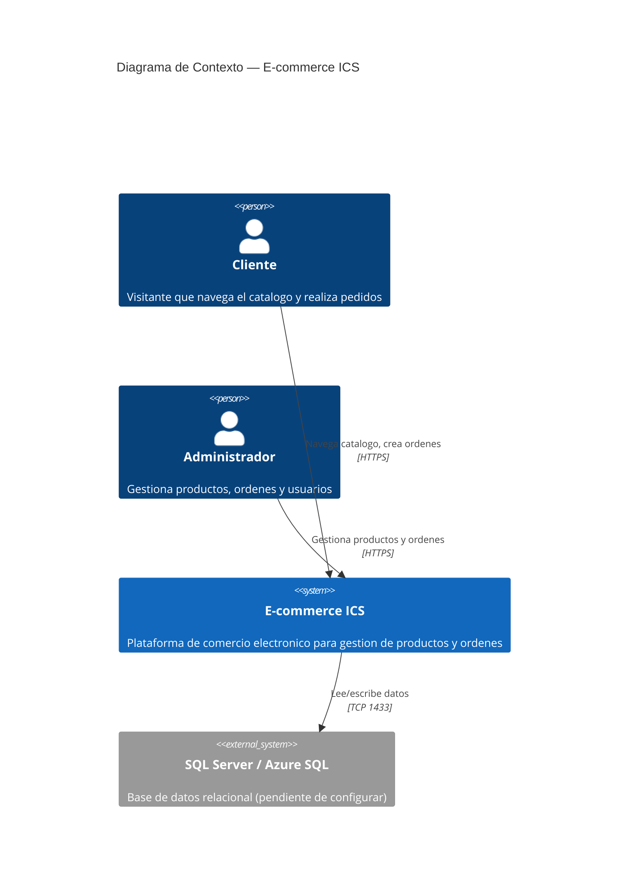
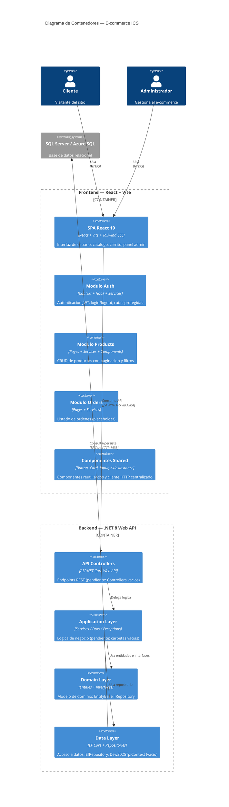

# TP1 — Diagnostico de Deuda Tecnica y Plan de Refactorizacion

**Materia:** Ingenieria y Calidad del Software
**Proyecto:** E-commerce ICS (React + .NET 8 + SQL Server)
**Fecha:** 2026

---

## 1. Diagrama de Arquitectura — C4 Model (Nivel 1: Contexto)



---

## 2. Diagrama de Arquitectura — C4 Model (Nivel 2: Contenedores)



---

## 3. Auditoria Tecnica — Hallazgos

---

### Hallazgo AT-01 — DbContext completamente vacio (Backend)

**Ubicacion:** Capa de Datos | Dsw2025Tpi.Data | Dsw2025TpiContext.cs

**Tipo:** Mantenibilidad / Calidad (Code Smell — Empty Class)

**Descripcion:**
El DbContext de Entity Framework Core esta completamente vacio. No contiene DbSet para ninguna entidad, no tiene OnModelCreating, y no recibe DbContextOptions en el constructor. Toda la capa de persistencia es inoperable.

**Evidencia simplificada:**

```csharp
// Dsw2025Tpi.Data/Dsw2025TpiContext.cs
using Microsoft.EntityFrameworkCore;

namespace Dsw2025Tpi.Data;

public class Dsw2025TpiContext: DbContext
{
}
```

**Problema identificado:**
El repositorio generico EfRepository depende de `_context.Set<T>()` y `_context.SaveChangesAsync()`, pero el contexto no tiene configuracion de tablas, relaciones ni cadena de conexion. Todo metodo invocado desde el repositorio lanzara una excepcion en runtime.

**Consecuencias:**
- El CRUD implementado en EfRepository es completamente inoperable
- No se puede persistir ni consultar ningun dato
- La capa de datos es solo una estructura vacia sin valor funcional
- Si se intenta usar, se obtiene `InvalidOperationException: No database provider has been configured`

**Principios afectados:**
- **Interface Segregation Principle (ISP):** IRepository define operaciones que el contexto no puede soportar
- **Dependency Inversion Principle (DIP):** La abstraccion (IRepository) depende de una concrecion rota (Dsw2025TpiContext vacio)

**Recomendacion:**
Crear todas las entidades de dominio (Product, Order, User, etc.), configurar DbSet para cada una, implementar OnModelCreating con Fluent API para relaciones e indices, y agregar connection string en appsettings.json.

**Impacto:** Muy Alto
**Esfuerzo estimado:** Alto (~4-6 horas)

---

### Hallazgo AT-02 — Servicio de ordenes usa fetch() nativo en vez de Axios (Frontend)

**Ubicacion:** Capa de Servicios | modules/orders/services | listServices.js

**Tipo:** Mantenibilidad / Calidad (Code Smell — Duplicated Logic / Inconsistent Pattern)

**Descripcion:**
El servicio de ordenes utiliza fetch() nativo con configuracion manual de headers y token, mientras que todos los demas servicios del proyecto (login.js, list.js, create.js) utilizan la instancia centralizada de Axios configurada en axiosInstance.js.

**Evidencia simplificada:**

```javascript
// src/modules/orders/services/listServices.js
export const listOrders = async () => {
  const response = await fetch('/api/orders', {
    method: 'GET',
    headers: {
      'Content-Type': 'application/json',
      'Authorization': `Bearer ${localStorage.getItem('token')}`,
    },
  });
  // ...
};

// Comparar: src/modules/products/services/list.js (usa Axios)
import { instance } from '../../shared/api/axiosInstance';

export const getProducts = async (search, status, pageNumber, pageSize) => {
  const response = await instance.get(`api/products/admin?${queryString}`);
  return { data: response.data, error: null };
};
```

**Problema identificado:**
Dos caminos diferentes para hacer peticiones HTTP en el mismo proyecto. El interceptor de Axios que maneja el token automaticamente y el redirect en 401 no se aplica a listServices.js.

**Consecuencias:**
- Si cambia la forma de obtener el token (ej: httpOnly cookies), hay que actualizar listServices.js por separado
- El interceptor de Axios no captura errores 401 de las peticiones fetch
- Duplicacion de logica de autenticacion (el token se configura manualmente)
- Inconsistencia: dos patrones de acceso a datos en el mismo modulo

**Principios afectados:**
- **Don't Repeat Yourself (DRY):** Logica de headers de autenticacion duplicada
- **Single Source of Truth:** Dos mecanismos de comunicacion HTTP sin coordinacion

**Recomendacion:**
Reemplazar fetch() por `instance.get('/api/orders')` de la instancia de Axios ya configurada. Eliminar la configuracion manual de headers.

**Impacto:** Alto
**Esfuerzo estimado:** Bajo (~15 minutos)

---

### Hallazgo AT-03 — Interceptor de Axios con navegacion forzada via window.location.href (Frontend)

**Ubicacion:** Capa de Infraestructura HTTP | modules/shared/api | axiosInstance.js

**Tipo:** Diseno / Mantenibilidad (Code Smell — Tight Coupling / Violacion de Separation of Concerns)

**Descripcion:**
El interceptor de respuesta de Axios maneja errores 401 ejecutando `window.location.href = '/login'`, lo que provoca un reload completo de la aplicacion SPA. Ademas, tiene conocimiento hardcodeado de la estructura de rutas (`/admin/`).

**Evidencia simplificada:**

```javascript
// src/modules/shared/api/axiosInstance.js (lineas 21-35)
instance.interceptors.response.use(
  (config) => { return config; },
  (error) => {
    if (error.status === 401) {
      if (window.location.pathname.includes('/admin/')) {
        localStorage.clear();
        window.location.href = '/login';
      } else {
        localStorage.removeItem('token');
      }
    }
    return Promise.reject(error);
  },
);
```

**Problema identificado:**
Un modulo de infraestructura HTTP (axiosInstance.js) tiene conocimiento de la estructura de rutas de la aplicacion (`/admin/`) y ejecuta navegacion directa. Esto viola la separacion de capas y provoca un reload completo que pierde todo el estado en memoria de React.

**Consecuencias:**
- Cada expiracion de token provoca un reload completo del SPA
- Se pierde estado no persistido: formularios a medio llenar, filtros, scroll position
- El interceptor esta acoplado a rutas especificas — si cambia la navegacion, hay que modificar el interceptor
- Dificulta testing: no se puede mockear la navegacion

**Principios afectados:**
- **Separation of Concerns:** La capa HTTP no deberia conocer rutas ni ejecutar navegacion
- **Single Responsibility Principle:** El interceptor tiene dos responsabilidades: manejar errores HTTP y navegar
- **Open/Closed Principle:** Agregar una nueva ruta protegida requiere modificar el interceptor

**Recomendacion:**
Inyectar la funcion de navegacion del router (o un callback de logout) al crear la instancia de Axios, o usar el contexto de auth para notificar el error 401 y que el router maneje la redireccion.

**Impacto:** Alto
**Esfuerzo estimado:** Medio (~1-2 horas)

---

### Hallazgo AT-04 — EfRepository sin Unit of Work (Backend)

**Ubicacion:** Capa de Datos | Dsw2025Tpi.Data/Repositories | EfRepository.cs

**Tipo:** Diseno / Seguridad (Code Smell — Missing Pattern / Violacion de Atomicidad)

**Descripcion:**
Cada operacion del repositorio (Add, Update, Delete) invoca SaveChangesAsync() individualmente. No hay mecanismo para agrupar multiples operaciones en una transaccion atomica.

**Evidencia simplificada:**

```csharp
// Dsw2025Tpi.Data/Repositories/EfRepository.cs
public async Task<T> Add<T>(T entity) where T : EntityBase
{
    await _context.AddAsync(entity);
    await _context.SaveChangesAsync();  // Commit inmediato
    return entity;
}

public async Task<T> Delete<T>(T entity) where T : EntityBase
{
    _context.Remove(entity);
    await _context.SaveChangesAsync();  // Commit inmediato
    return entity;
}

public async Task<T> Update<T>(T entity) where T : EntityBase
{
    _context.Update(entity);
    await _context.SaveChangesAsync();  // Commit inmediato
    return entity;
}
```

**Problema identificado:**
Si una operacion de negocio requiere multiples cambios (ej: crear una orden + actualizar stock de 5 productos), cada cambio se confirma por separado. Si falla la mitad del proceso, la BD queda en estado inconsistente.

**Consecuencias:**
- No se puede garantizar atomicidad en operaciones compuestas
- Si falla la actualizacion del stock despues de crear la orden, la BD queda con una orden sin stock descontado
- El requisito de negocio "verificar stock antes de confirmar orden" no puede implementarse de forma segura
- Riesgo de datos corruptos en produccion

**Principios afectados:**
- **Unit of Work Pattern:** No implementado — cada operacion es una transaccion independiente
- **ACID (Atomicity):** La atomicidad no esta garantizada a nivel de aplicacion

**Recomendacion:**
Implementar IUnitOfWork con un SaveChangesAsync() centralizado. Los servicios de negocio abstraen el contexto y llaman a `unitOfWork.SaveChangesAsync()` al final de la operacion compuesta.

**Impacto:** Muy Alto
**Esfuerzo estimado:** Medio (~2-3 horas)

---

### Hallazgo AT-05 — API sin CORS, sin DI y sin referencias entre capas (Backend)

**Ubicacion:** Capa de Presentacion | Dsw2025Tpi.Api | Program.cs + Dsw2025Tpi.Api.csproj

**Tipo:** Diseno / Seguridad (Code Smell — Broken Architecture / Missing Infrastructure)

**Descripcion:**
Tres problemas criticos de infraestructura convergen en la capa API: no hay CORS configurado (el frontend no puede comunicarse), no hay registro de dependencias (los controllers no pueden inyectar servicios), y el proyecto Api no referencia al proyecto Data (la arquitectura en capas es solo una convencion de carpetas).

**Evidencia simplificada:**

```csharp
// Dsw2025Tpi.Api/Program.cs
var builder = WebApplication.CreateBuilder(args);

builder.Services.AddControllers();
builder.Services.AddEndpointsApiExplorer();
builder.Services.AddSwaggerGen();
builder.Services.AddHealthChecks();
// No hay AddCors()
// No hay AddDbContext()
// No hay AddScoped<IRepository, EfRepository>()

var app = builder.Build();
// No hay UseCors()
// No hay UseAuthentication() / UseAuthorization() real

app.MapControllers();
app.MapHealthChecks("/healthcheck");
app.Run();
```

```xml
<!-- Dsw2025Tpi.Api/Dsw2025Tpi.Api.csproj -->
<ItemGroup>
    <PackageReference Include="Swashbuckle.AspNetCore" Version="6.6.2" />
</ItemGroup>
<ItemGroup>
    <Folder Include="Controllers\" />
</ItemGroup>
<!-- No hay ProjectReference a Data ni a Application -->
```

**Problema identificado:**
La API no puede funcionar en conjunto con el frontend porque:
1. Sin CORS, el navegador bloquea las peticiones cross-origin (frontend en :5173, backend en :5142)
2. Sin DI, los controllers no pueden recibir repositorios o servicios por inyeccion
3. Sin ProjectReference, Api no puede importar tipos de Data o Application

**Consecuencias:**
- Las peticiones del frontend al backend retornan error CORS — la aplicacion no funciona
- Los controllers (cuando se creen) no pueden usar inyeccion de dependencias
- La arquitectura en capas es visual pero no funcional — las dependencias no estan declaradas
- UseAuthorization() no tiene UseAuthentication() previo, por lo que no funciona

**Principios afectados:**
- **Dependency Inversion Principle (DIP):** No hay registro de dependencias en el contenedor IoC
- **Separation of Concerns:** Las capas no estan desacopladas porque Api no conoce a Data
- **Configuration over Convention:** La arquitectura depende de convencion manual sin soporte del framework

**Recomendacion:**
1. Agregar AddCors() y UseCors() con la politica del frontend
2. Agregar AddDbContext y AddScoped
3. Agregar ProjectReference a Data en el .csproj

**Impacto:** Muy Alto
**Esfuerzo estimado:** Bajo (~30 minutos)

---

## 4. Matriz de Priorizacion — Esfuerzo vs. Impacto

| | **Impacto Bajo** | **Impacto Alto** | **Impacto Muy Alto** |
|---|---|---|---|
| **Esfuerzo Bajo** | Mejoras menores | **AT-02** fetch vs Axios | **AT-05** CORS + DI + References |
| **Esfuerzo Medio** | — | **AT-03** Interceptor navegacion | **AT-04** Sin Unit of Work |
| **Esfuerzo Alto** | — | — | **AT-01** DbContext vacio |

### Leyenda de prioridad

- **Prioridad 1 (Hacer ya):** AT-05 — Esfuerzo bajo, impacto muy alto. Sin esto nada funciona.
- **Prioridad 2 (Hacer pronto):** AT-02 — Esfuerzo bajo, impacto alto. Inconsistencia que genera bugs.
- **Prioridad 3 (Planificar):** AT-04 — Esfuerzo medio, impacto muy alto. Riesgo de datos corruptos.
- **Prioridad 4 (Planificar):** AT-03 — Esfuerzo medio, impacto alto. Mala experiencia de usuario.
- **Prioridad 5 (Proyecto grande):** AT-01 — Esfuerzo alto, impacto muy alto. Requiere diseno de entidades completo.

---

## 5. Plan de Refactorizacion — Backlog Priorizado

| # | Hallazgo | Accion | Esfuerzo | Impacto | Prioridad |
|---|---|---|---|---|---|
| 1 | AT-05 | Agregar CORS, DI y ProjectReference en Api | Bajo | Muy Alto | P1 |
| 2 | AT-02 | Reemplazar fetch() por Axios en listServices.js | Bajo | Alto | P2 |
| 3 | AT-04 | Implementar IUnitOfWork en EfRepository | Medio | Muy Alto | P3 |
| 4 | AT-03 | Desacoplar interceptor de navegacion en axiosInstance.js | Medio | Alto | P4 |
| 5 | AT-01 | Crear entidades, DbSet, OnModelCreating y migracion | Alto | Muy Alto | P5 |
