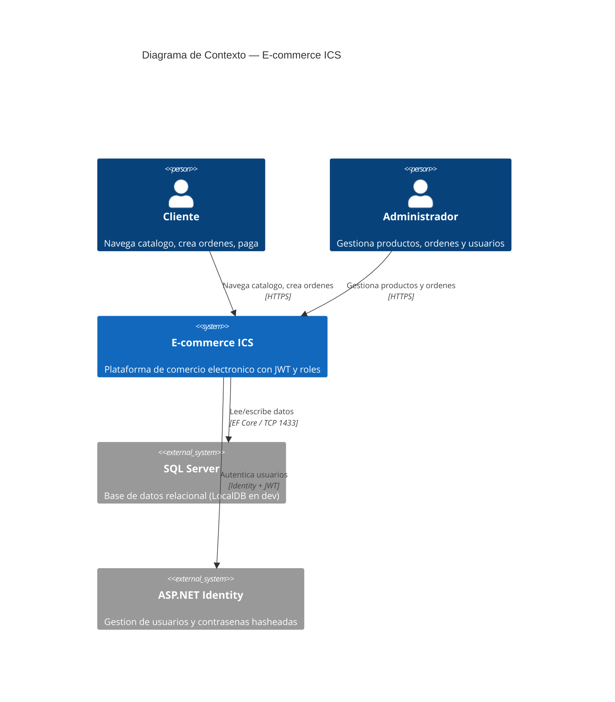
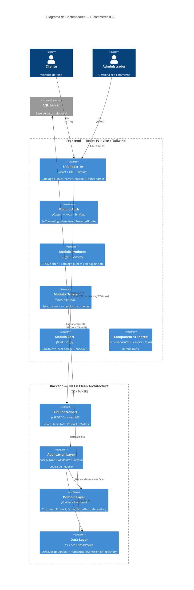
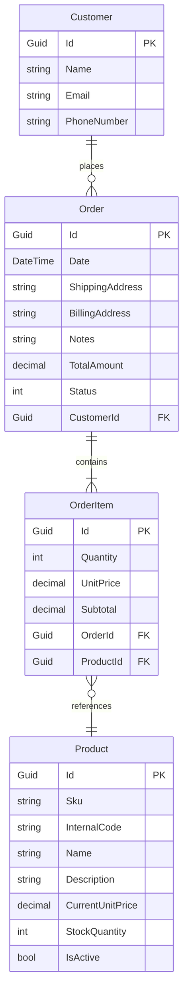

# TP1 — Auditoria Tecnica y Plan de Refactorizacion

**Materia:** Ingenieria y Calidad del Software
**Proyecto:** E-commerce ICS (React 19 + .NET 8 + SQL Server)
**Fecha:** 2026
**Estado:** Actualizado — basado en analisis del codigo fuente real

---

## 1. Diagrama de Arquitectura — C4 Model (Nivel 1: Contexto)



---

## 2. Diagrama de Arquitectura — C4 Model (Nivel 2: Contenedores)



---

## 3. Modelado de Dominio

### 3.1 Estado Actual — Entidades Implementadas

Archivos en `Domain/Entities/`:

```
Domain/Entities/
├── EntityBase.cs         ← Base abstracta (Guid Id)
├── Customer.cs           ← Name, Email, PhoneNumber
├── Product.cs            ← SKU, Name, Price, Stock, IsActive
├── Order.cs              ← Date, Addresses, Status, FK->Customer
├── OrderItem.cs          ← Qty, Price, FK->Order, FK->Product
└── OrderStatus.cs        ← Enum: PENDING..CANCELLED
```

Estado de las capas:

| Capa | Archivo | Estado |
|------|---------|--------|
| Domain | EntityBase.cs | Implementado |
| Domain | IRepository.cs | Generico CRUD |
| Domain | Customer.cs | Implementado |
| Domain | Product.cs | Implementado |
| Domain | Order.cs | Implementado |
| Domain | OrderItem.cs | Implementado |
| Domain | OrderStatus.cs | Implementado |
| Data | Dsw2025TpiContext.cs | Configurado (Fluent API, 4 DbSets) |
| Data | AuthenticateContext.cs | Configurado (IdentityDbContext) |
| Data | EfRepository.cs | Implementado |
| Data | Migraciones | 3 migraciones (2 Business + 1 Identity) |
| Data | Seed data | Products.json, Customers.json, Orders.json |
| Application | ProductsManagementServices.cs | Implementado |
| Application | OrdersManagementServices.cs | Implementado |
| Application | JwtTokenService.cs | Implementado |
| Application | DTOs (6 archivos) | Implementados |
| Application | Validators (4 archivos) | Estaticos, manuales |
| Application | Exceptions (3 archivos) | Implementadas |
| Api | AuthenticateController.cs | Login + Register |
| Api | ProductsController.cs | CRUD + Admin list |
| Api | OrderController.cs | CRUD + Status update |

### 3.2 Modelo de Dominio — Entidades Reales

#### Diagrama ER (Implementado)



Relaciones:
- Customer 1--* Order (un cliente tiene muchas ordenes)
- Order 1--* OrderItem (una orden tiene muchos items)
- OrderItem *--1 Product (un item referencia un producto)

Computed properties:
- Order.TotalAmount => OrderItems.Sum(x => x.Subtotal)
- OrderItem.Subtotal => Quantity * UnitPrice

### 3.3 Comparativa: Plan vs Implementacion

| Aspecto | Plan original | Implementacion actual |
|---------|---------------|----------------------|
| Entidad de usuario | User (custom) | IdentityUser (ASP.NET Identity) + Customer (espejo) |
| Roles | Enteros (0=Admin, 1=Client) | Strings ("Admin", "User") via Identity |
| Categorias | Entidad Category con FK en Product | No implementada |
| PaymentMethod | Entidad separada | No implementada |
| ShippingAddress | Value Object embebido | Campo string? simple en Order |
| BillingInfo | Value Object embebido | Campo string? simple en Order |
| OrderNumber | Campo unico | No existe (se usa Id como identificador) |

---

## 4. Auditoria Tecnica — Hallazgos

### 4.1 Presentacion TP1 — 9 Hallazgos de Deuda Tecnica

Los 9 hallazgos de deuda tecnica mas relevantes para la presentacion del TP1, seleccionados por impacto y relevancia academica.

> **Nota:** Para ver el listado completo de bugs y deuda tecnica (diferenciados), consultar `TP1_Hallazgos_Adicionales.md`.

---

#### Backend — 4 Hallazgos

---

##### Hallazgo AT-01 — JWT secret key en appsettings.json (CRITICO)

**Ubicacion:** Dsw2025Tpi.Api/appsettings.json linea 11

**Tipo:** Seguridad (Critical — Secret Exposed)

**Descripcion:**
La clave secreta para firmar JWT esta hardcodeada en appsettings.json y commiteada al repositorio. Cualquier persona con acceso al repo puede forjar tokens validos.

**Evidencia:**

```json
"Jwt": {
    "Key": "clave_super_secreta_12345678910211123123123123213123"
}
```

**Consecuencias:**
- Cualquiera con acceso al repo puede generar tokens JWT validos
- Suplantacion de identidad trivial
- Compromiso total del sistema de autenticacion

**Recomendacion:** Mover a User Secrets en desarrollo, Azure Key Vault o Variables de Entorno en produccion.

**Impacto:** Critico | **Esfuerzo:** Bajo (~15 min)

---

##### Hallazgo AT-02 — Credenciales admin en plaintext (CRITICO)

**Ubicacion:** Dsw2025Tpi.Api/appsettings.json linea 24-27

**Tipo:** Seguridad (Critical — Credentials Exposed)

**Descripcion:**
Las credenciales del usuario admin por defecto estan en texto plano en el archivo de configuracion.

**Evidencia:**

```json
"DefaultAdmin": {
    "Username": "admin",
    "Password": "SecurePassword123!",
    "Role": "Admin"
}
```

**Consecuencias:**
- Cualquiera con acceso al repo tiene las credenciales de admin
- En produccion, acceso total al sistema

**Recomendacion:** Mover a User Secrets / Variables de Entorno. Generar password aleatorio en la primera ejecucion.

**Impacto:** Critico | **Esfuerzo:** Bajo (~15 min)

---

##### Hallazgo AT-06 — Dependencia circular Application -> Data (ALTO)

**Ubicacion:** Dsw2025Tpi.Application/Dsw2025Tpi.Application.csproj

**Tipo:** Arquitectura (High — Clean Architecture Violation)

**Descripcion:**
La capa Application referencia directamente a la capa Data, lo cual viola Clean Architecture. Application solo deberia depender de Domain (interfaces).

```
Flujo correcto:  Api -> Application -> Domain <- Data
Flujo actual:    Api -> Application -> Data -> Domain
```

**Consecuencias:**
- Application no puede ser reutilizada sin Data
- Dificulta testing (no se puede mockear el repositorio facilmente)
- Violacion del Dependency Inversion Principle (DIP)

**Recomendacion:** Application solo debe referenciar Domain. El registro de implementaciones concretas (EfRepository) se hace en Api/Program.cs via DI.

**Impacto:** Alto | **Esfuerzo:** Medio (~1-2 horas)

---

##### Hallazgo AT-07 — Sin Unit of Work y queries N+1 en operaciones de ordenes (ALTO)

**Ubicacion:** Dsw2025Tpi.Data/Repositories/EfRepository.cs, Dsw2025Tpi.Application/Services/OrdersManagementServices.cs (metodos AddOrder y UpdateOrderStatus)

**Tipo:** Arquitectura / Calidad (High — Missing Atomicity Pattern + N+1 Queries)

**Descripcion:**
Cada operacion del repositorio invoca SaveChangesAsync() individualmente. No hay transacciones que agrupen multiples operaciones. Ademas, al crear y cancelar ordenes, el servicio itera por cada item ejecutando GetById + Update secuencialmente, generando el patron N+1 queries.

**Evidencia:**

```csharp
// EfRepository.cs — Cada Update hace SaveChangesAsync inmediato
public async Task<T> Update<T>(T entity) where T : EntityBase
{
    _context.Update(entity);
    await _context.SaveChangesAsync();  // Commit inmediato por cada item
    return entity;
}

// OrdersManagementServices.cs — AddOrder: por cada item, 2 viajes a la BD (N+1)
foreach (var item in request.OrderItems)
{
    var product = await _repository.GetById<Product>(item.ProductId);  // Query 1
    ...
    product.StockQuantity -= item.Quantity;
    await _repository.Update(product);                                 // Query 2 (con SaveChanges)
    ...
}
await _repository.Add(order);  // Query final
```

**Problema identificado:** Para una orden de N items, se generan aproximadamente 2N viajes secuenciales a la base de datos. Cada Update confirma los cambios en la BD por separado, no todos juntos.

**Consecuencias:**
- **Atomicidad:** La creacion de una orden no es atomica. Si falla la mitad del proceso, la BD queda en estado inconsistente.
- **Rendimiento:** Con ordenes grandes el tiempo de respuesta crece linealmente.
- **Riesgo:** Datos corruptos en produccion por falta de transaccion.

**Recomendacion:** (1) Envolver el bucle en una transaccion explícita con BeginTransaction y Commit al final. (2) Traer todos los productos necesarios en una sola consulta antes del loop, validar stock en memoria, y guardar todos los cambios juntos con un unico SaveChangesAsync.

**Impacto:** Alto | **Esfuerzo:** Medio (~2-3 horas)

---

##### Hallazgo AT-09 — Sin global exception handling middleware (ALTO)

**Ubicacion:** Dsw2025Tpi.Api/Program.cs

**Tipo:** Arquitectura (High — Missing Cross-Cutting Concern)

**Descripcion:**
No hay middleware de manejo de excepciones global. Cada controller tiene su propio try/catch con patrones inconsistentes.

**Consecuencias:**
- Errores no controlados retornan 500 con stack trace (en dev)
- Sin formato consistente de errores
- El frontend tiene mapeo de errores que puede no funcionar

**Recomendacion:** Crear GlobalExceptionMiddleware que capture excepciones y las transforme en respuestas ProblemDetails consistentes.

**Impacto:** Alto | **Esfuerzo:** Medio (~2 horas)

---

#### Frontend — 5 Hallazgos

---

##### Hallazgo AT-04 — Token en localStorage vulnerable a XSS (ALTO)

**Ubicacion:** Frontend — auth/context/AuthProvider.jsx, Backend — AuthenticateController.cs

**Tipo:** Seguridad (High — XSS Vulnerability)

**Descripcion:**
El JWT se almacena en localStorage, accesible por cualquier script que se ejecute en la pagina. Migrar a HttpOnly cookies requiere cambios en **ambas capas**: el frontend debe enviar las cookies y el backend debe configurarlas y validarlas.

**Evidencia:**

```javascript
// Frontend: actualmente usa localStorage
localStorage.setItem('token', data);
const token = localStorage.getItem('token');
config.headers.Authorization = `Bearer ${token}`;
```

**Consecuencias:** Robo de sesion via XSS, suplantacion de identidad.

**Alcance del cambio:**
- **Frontend:** Dejar de leer/escribir localStorage. Axios debe enviar cookies automaticamente (`withCredentials: true`).
- **Backend:** El endpoint de login debe devolver el token como HttpOnly cookie (`Set-Cookie`). Los endpoints protegidos deben leer el token de la cookie en vez del header Authorization.

**Recomendacion:** Mover a HttpOnly cookie. Ver tambien AT-28 (backend) y AT-29 (seguridad avanzada de cookies) en `TP1_Hallazgos_Adicionales.md`.

**Impacto:** Alto | **Esfuerzo:** Medio (~3-4 horas)

---

##### Hallazgo AT-16 — useCart no es shared state (ALTO)

**Ubicacion:** Frontend — cart/hooks/useCart.js

**Tipo:** Arquitectura (High — State Management Issue)

**Descripcion:**
Cada llamada a useCart() crea una instancia independiente de estado con su propio useState + useEffect. No hay Context como AuthContext.

**Consecuencias:**
- El badge del carrito en el header no se actualiza al agregar items
- Cada componente tiene su propia copia del carrito
- Estado desincronizado entre paginas

**Recomendacion:** Envolver useCart en un Context (similar a AuthContext) para estado global.

**Impacto:** Alto | **Esfuerzo:** Medio (~1-2 horas)

---

##### Hallazgo AT-17 — window.dispatchEvent para comunicacion entre componentes (MEDIO)

**Ubicacion:** Frontend — LoginModal.jsx, RegisterModal.jsx, ListProductsUserPage.jsx, CartPage.jsx

**Tipo:** Calidad (Medium — Anti-Pattern)

**Descripcion:**
Los modales de login y register se comunican via window.dispatchEvent('open-login') / window.dispatchEvent('open-register'). Esto bypassa el flujo de datos de React.

**Consecuencias:**
- Invisible en React DevTools
- Imposible de testear
- Acoplamiento invisible entre componentes

**Recomendacion:** Usar Context o estado levantado en un componente padre comun.

**Impacto:** Medio | **Esfuerzo:** Medio (~1 hora)

---

##### Hallazgo AT-18 — Interceptor usa window.location.href (MEDIO)

**Ubicacion:** Frontend — shared/api/axiosInstance.js lineas 21-36

**Tipo:** Calidad (Medium — Tight Coupling)

**Descripcion:**
El interceptor de respuesta hace window.location.href = '/login' en 401 para rutas admin, causando reload completo de la SPA.

**Consecuencias:**
- Cada expiracion de token pierde todo el estado en memoria de React
- El interceptor conoce la estructura de rutas (acoplado a /admin/)

**Recomendacion:** Inyectar navegacion via callback o usar el contexto de auth para notificar el 401.

**Impacto:** Medio | **Esfuerzo:** Medio (~1-2 horas)

---

##### Hallazgo AT-15 — createOrder.js rompe contrato {data, error} (MEDIO)

**Ubicacion:** Frontend — orders/services/createOrder.js

**Tipo:** Calidad (Medium — Inconsistent Contract)

**Descripcion:**
Todos los servicios retornan {data, error} via handleApiCall. createOrder.js retorna solo {data} en exito y {error} en fallo, sin la clave error en exito ni data en fallo.

**Consecuencias:**
- Funciona por accidente (undefined es falsy)
- Rompera si alguien agrega chequeo explicito error === null

**Recomendacion:** Unificar todos los servicios para usar handleApiCall consistentemente.

**Impacto:** Alto | **Esfuerzo:** Bajo (~15 min)

---

### 4.2 Otros Hallazgos

Para el listado completo de bugs y deuda tecnica adicionales (diferenciados entre backend y frontend), consultar el archivo `TP1_Hallazgos_Adicionales.md`.

**Resumen rapido:**

| Capa | Bugs | Deuda Tecnica |
|------|------|---------------|
| Backend | AT-27 (BOLA), AT-13 (GUIDs duplicados), AT-12 (sin unique index), AT-25 (validator no llamado), AT-15 (contrato inconsistente) | AT-05 (password policy), AT-28 (backend cookies), AT-29 (seguridad cookies), AT-10 (HasPrecision en string), AT-11 (MaxLength en DateTime), AT-14 (typo TotatAmount), AT-26 (LocalDB no apto), AT-24 (excepciones inconsistentes), AT-08 (codigo muerto), AT-23 (typo archivo), AT-03 (sin repositorio por entidad) |
| Frontend | AT-19 (fallback fetch mixto) | AT-20 (withCredentials), AT-21 (imagenes CDN), AT-22 (SweetAlert2 no usado) |

---

## 5. Matriz de Priorizacion — 9 Deudas Tecnicas Destacadas

| | Impacto Alto | Impacto Critico |
|---|---|---|
| **Esfuerzo Bajo** | — | AT-01, AT-02 |
| **Esfuerzo Medio** | AT-06, AT-07, AT-09, AT-04, AT-16, AT-17, AT-18 | — |

### Leyenda de prioridad

- **P1 — Critico (hacer ya):** AT-01 + AT-02 — Secret y credenciales expuestas. Si el repo es publico, el sistema esta comprometido.
- **P2 — Hacer pronto:** AT-06 + AT-07 + AT-09 — Arquitectura: dependencia circular, UoW, exception handling.
- **P3 — Planificar:** AT-04 + AT-16 — Seguridad en frontend y estado global del carrito.
- **P4 — Mejoras:** AT-17 + AT-18 — Frontend patterns.

> **Nota:** Para bugs y deuda tecnica adicional (incluyendo AT-03 repositorio generico, AT-28 backend cookies, AT-29 seguridad cookies), ver `TP1_Hallazgos_Adicionales.md`.

---

## 6. Plan de Refactorizacion — 9 Deudas Tecnicas Destacadas

| # | Hallazgo | Accion | Esfuerzo | Impacto | Prioridad |
|---|---|---|---|---|---|
| 1 | AT-01 | Mover JWT secret a User Secrets / Env Vars | Bajo | Critico | P1 |
| 2 | AT-02 | Mover credenciales admin a User Secrets / Env Vars | Bajo | Critico | P1 |
| 3 | AT-06 | Corregir dependencia circular Application->Data | Medio | Alto | P2 |
| 4 | AT-07 | Implementar Unit of Work + resolver N+1 queries | Medio | Alto | P2 |
| 5 | AT-09 | Crear GlobalExceptionMiddleware | Medio | Alto | P2 |
| 6 | AT-04 | Mover token a HttpOnly cookie (o BFF pattern) | Medio | Alto | P3 |
| 7 | AT-16 | Convertir useCart a Context para shared state | Medio | Alto | P3 |
| 8 | AT-17 | Reemplazar window.dispatchEvent por Context | Medio | Medio | P4 |
| 9 | AT-18 | Desacoplar interceptor de navegacion | Medio | Medio | P4 |

> **Nota:** Para bugs y deuda tecnica adicional (20 hallazgos mas, incluyendo AT-28 backend cookies y AT-29 seguridad cookies), ver `TP1_Hallazgos_Adicionales.md`.

---

## 7. Resumen Ejecutivo

### Estado del proyecto

El proyecto tiene una base solida implementada: Clean Architecture en 4 capas, entidades de dominio, autenticacion JWT con ASP.NET Identity, controllers, servicios, DTOs, y un frontend funcional con 6 modulos (auth, products, orders, cart, home, shared).

**Infraestructura de BD:** Actualmente usa LocalDB (limitado, solo Windows). Se recomienda migrar a Docker SQL Server (ver AT-26 y PLAN.md Fase 0).

### Hallazgos totales identificados: 29

**En este archivo (TP1_Resuelto):** 9 deudas tecnicas destacadas para presentacion (4 backend + 5 frontend)

**En TP1_Hallazgos_Adicionales.md:** 20 hallazgos adicionales (bugs + deuda tecnica)

| Tipo | Backend | Frontend | Total |
|------|---------|----------|-------|
| **Deuda tecnica (destacada)** | 4 (AT-01, AT-02, AT-06, AT-07, AT-09) | 5 (AT-04, AT-16, AT-17, AT-18) | **9** |
| **Bugs** | 5 (AT-27, AT-13, AT-12, AT-25, AT-15) | 1 (AT-19) | **6** |
| **Deuda tecnica (adicional)** | 11 (AT-03, AT-05, AT-28, AT-29, AT-10, AT-11, AT-14, AT-26, AT-24, AT-08, AT-23) | 3 (AT-20, AT-21, AT-22) | **14** |
| **Total** | **20** | **9** | **29** |

### Esfuerzo total estimado para resolver todo: ~18-23 horas

### Prioridad inmediata (proximas 2-3 horas):
1. Mover secret y credenciales a variables de entorno
2. Fortalecer password policy
3. Agregar rate limiting
4. Corregir bugs en DbContext
5. Agregar unique index en SKU
6. Corregir typo TotatAmount
7. Corregir BOLA en creacion de ordenes
8. **Migrar de LocalDB a Docker SQL Server** (ver PLAN.md Fase 0)
